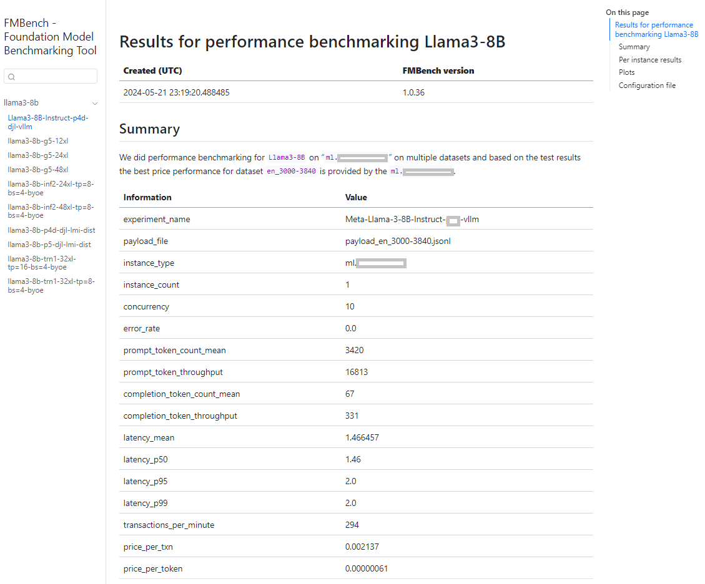

<!-- START doctoc generated TOC please keep comment here to allow auto update -->

**Table of Contents**  *generated with [DocToc](https://github.com/ktechhub/doctoc)*

<!---toc start-->

* [Foundation Model benchmarking tool (FMBench)](#foundation-model-benchmarking-tool-fmbench)
* [Overview](#overview)
  * [Models benchmarked](#models-benchmarked)
    * [Llama3 on Amazon SageMaker ](#llama3-on-amazon-sagemaker)
    * [Full list of benchmarked models](#full-list-of-benchmarked-models)
  * [New in this release](#new-in-this-release)
    * [v1.0.48](#v1048)
  * [Description](#description)
    * [Workflow for `FMBench`](#workflow-for-fmbench)
  * [Getting started](#getting-started)
    * [Quickstart](#quickstart)
    * [Run `FMBench` on Amazon EC2](#run-fmbench-on-amazon-ec2)
    * [Steps to run](#steps-to-run)
  * [Results](#results)
    * [An internal `FMBench` website](#an-internal-fmbench-website)
  * [Benchmark models deployed on different AWS Generative AI services](#benchmark-models-deployed-on-different-aws-generative-ai-services)
    * [Benchmark models on Bedrock](#benchmark-models-on-bedrock)
    * [Benchmark models on SageMaker](#benchmark-models-on-sagemaker)
    * [Benchmark models on EKS](#benchmark-models-on-eks)
    * [Benchmark models on EC2](#benchmark-models-on-ec2)
  * [Advanced functionality](#advanced-functionality)
    * [Bring your own endpoint (a.k.a. support for external endpoints)](#bring-your-own-endpoint-aka-support-for-external-endpoints)
    * [Bring your own `REST Predictor` (\[`data-on-eks`\](https://github.com/awslabs/data-on-eks/tree/7173cd98c9be6f555afc42f8311cc7849f74a038) version)](#bring-your-own-rest-predictor-data-on-ekshttpsgithubcomawslabsdata-on-ekstree7173cd98c9be6f555afc42f8311cc7849f74a038-version)
    * [Bring your own dataset](#bring-your-own-dataset)
      * [Support for Open-Orca dataset](#support-for-open-orca-dataset)
    * [Building the `FMBench` Python package](#building-the-fmbench-python-package)
  * [Pending enhancements](#pending-enhancements)
  * [Security](#security)
  * [License](#license)
  * [Star History](#star-history)

<!---toc end-->

<!-- END doctoc generated TOC please keep comment here to allow auto update -->


# Overview

<h1 align="center">
        </img>
    </h1>
    <p align="center">
        <p align="center">Benchmark any Foundation Model (FM) on any AWS Generative AI service [Amazon SageMaker, Amazon Bedrock, Amazon EKS, Bring your own endpoint etc.]
        <br>
    </p>
<h4 align="center"><a href="" target="_blank">Amazon Bedrock</a> | <a href="" target="_blank">Amazon SageMaker</a> | <a href="" target="_blank">Amazon EKS</a> | <a href="" target="_blank">Amazon EC2</a></h4>
<h4 align="center">
    <a href="https://pypi.org/project/fmbench/" target="_blank">
        
    </a>    
</h4>

A key challenge with FMs is the ability to benchmark their performance in terms of inference latency, throughput and cost so as to determine which model running with what combination of the hardware and serving stack provides the best price-performance combination for a given workload.

Stated as **business problem**, the ask is “_*What is the dollar cost per transaction for a given generative AI workload that serves a given number of users while keeping the response time under a target threshold?*_”

But to really answer this question, we need to answer an **engineering question** (an optimization problem, actually) corresponding to this business problem: “*_What is the minimum number of instances N, of most cost optimal instance type T, that are needed to serve a workload W while keeping the average transaction latency under L seconds?_*”

*W: = {R transactions per-minute, average prompt token length P, average generation token length G}*

This foundation model benchmarking tool (a.k.a. `FMBench`) is a tool to answer the above engineering question and thus answer the original business question about how to get the best price performance for a given workload. Here is one of the plots generated by `FMBench` to help answer the above question (_the instance types in the legend have been blurred out on purpose, you can find them in the actual plot generated on running `FMBench`_).


## Models benchmarked

Configuration files are available in the [configs](./src/fmbench/configs) folder for the following models in this repo.

### Llama3 on Amazon SageMaker

Llama3 is now available on SageMaker (read [blog post](https://aws.amazon.com/blogs/machine-learning/meta-llama-3-models-are-now-available-in-amazon-sagemaker-jumpstart/)), and you can now benchmark it using `FMBench`. Here are the config files for benchmarking `Llama3-8b-instruct` and `Llama3-70b-instruct` on `ml.p4d.24xlarge`, `ml.inf2.24xlarge` and `ml.g5.12xlarge` instances.

- [Config file](https://github.com/aws-samples/foundation-model-benchmarking-tool/blob/main/src/fmbench/configs/llama3/8b/config-llama3-8b-instruct-g5-p4d.yml) for `Llama3-8b-instruct` on  `ml.p4d.24xlarge` and `ml.g5.12xlarge`.
- [Config file](https://github.com/aws-samples/foundation-model-benchmarking-tool/blob/main/src/fmbench/configs/llama3/70b/config-llama3-70b-instruct-g5-p4d.yml) for `Llama3-70b-instruct` on  `ml.p4d.24xlarge` and `ml.g5.48xlarge`.
- [Config file](https://github.com/aws-samples/foundation-model-benchmarking-tool/blob/main/src/fmbench/configs/llama3/8b/config-llama3-8b-inf2-g5.yml) for `Llama3-8b-instruct` on  `ml.inf2.24xlarge` and `ml.g5.12xlarge`.

### Full list of benchmarked models

| Model    | SageMaker g4dn/g5/p3 | SageMaker Inf2 | SageMaker P4 | SageMaker P5 | Bedrock On-demand throughput | Bedrock provisioned throughput |
|:------------------|:-----------------|:----------------|:--------------|:--------------|:------------------------------|:--------------------------------|
| **Anthropic Claude-3 Sonnet** | | |  | | ✅ | ✅  | 
| **Anthropic Claude-3 Haiku**  | | |  | | ✅ |   |
| **Mistral-7b-instruct** |✅ | |✅  |✅ | ✅ |   |
| **Mistral-7b-AWQ** || | |✅ | |   |
| **Mixtral-8x7b-instruct**  | | |  | | ✅ |   |
| **Llama3-8b instruct**  |✅ |✅|✅  | ✅|✅  |   |
| **Llama3-70b instruct**  |✅ |✅|✅  | |✅ |   |
| **Llama2-13b chat**  |✅ |✅ |✅  | | ✅  |   |
| **Llama2-70b chat**  |✅ |✅ |✅  | | ✅  |   |
| **Amazon Titan text lite**  | | |  | | ✅ |   |
| **Amazon Titan text express**  | | |  | | ✅ |   |
| **Cohere Command text**  | | |  | | ✅ |   |
| **Cohere Command light text**  | | |  | | ✅ |   |
| **AI21 J2 Mid**  | | |  | | ✅ |   |
| **AI21 J2 Ultra** | | |  | | ✅ |   |
| **Gemma-2b** |✅ | |  | |  |   |
| **Phi-3-mini-4k-instruct** |✅ | |  | |  |   |
| **distilbert-base-uncased**  |  ✅ | |  | ||   |

## New in this release

### v1.0.48
1. Faster result file download at the end of a test run.
1. `Phi-3-mini-4k-instruct` configuration file.
1. Tokenizer and misc. bug fixes.

### v1.0.47
1. Run `FMBench` as a Docker container.
1. Bug fixes for GovCloud support.
1. Updated README for EKS cluster creation.

### v1.0.46
1. Native model deployment support for EC2 and EKS (i.e. you can now deploy and benchmark models on EC2 and EKS).
1. FMBench is now available in GovCloud.
1. Update to latest version of several packages.

[Release history](./release_history.md)

## Description

`FMBench` is a Python package for running performance benchmarks for **any Foundation Model (FM)** deployed on **any AWS Generative AI service**, be it **Amazon SageMaker**, **Amazon Bedrock**, **Amazon EKS**, or **Amazon EC2**. The FMs could be deployed on these platforms either directly through `FMbench`, or, if they are already deployed then also they could be benchmarked through the **Bring your own endpoint** mode supported by `FMBench`. 

Here are some salient features of `FMBench`:

1. **Highly flexible**: in that it allows for using any combinations of instance types (`g5`, `p4d`, `p5`, `Inf2`), inference containers (`DeepSpeed`, `TensorRT`, `HuggingFace TGI` and others) and parameters such as tensor parallelism, rolling batch etc. as long as those are supported by the underlying platform. 

1. **Benchmark any model**: it can be used to be benchmark _open-source models_, _third party models_, and _proprietary models_ trained by enterprises on their own data.

1. **Run anywhere**: it can be run on any AWS platform where we can run Python, such as Amazon EC2, Amazon SageMaker, or even the AWS CloudShell. _It is important to run this tool on an AWS platform so that internet round trip time does not get included in the end-to-end response time latency_.

### Workflow for `FMBench`

The workflow for `FMBench` is as follows:

```
Create configuration file
        |
        |-----> Deploy model on SageMaker/Use models on Bedrock/Bring your own endpoint
                    |
                    |-----> Run inference against deployed endpoint(s)
                                     |
                                     |------> Create a benchmarking report
```

1. Create a dataset of different prompt sizes and select one or more such datasets for running the tests.
    1. Currently `FMBench` supports datasets from [LongBench](https://github.com/THUDM/LongBench) and filter out individual items from the dataset based on their size in tokens (for example, prompts less than 500 tokens, between 500 to 1000 tokens and so on and so forth). Alternatively, you can download the folder from [this link](https://huggingface.co/datasets/THUDM/LongBench/resolve/main/data.zip) to load the data.

1. Deploy **any model** that is deployable on SageMaker on **any supported instance type** (`g5`, `p4d`, `Inf2`).
    1. Models could be either available via SageMaker JumpStart (list available [here](https://sagemaker.readthedocs.io/en/stable/doc_utils/pretrainedmodels.html)) as well as models not available via JumpStart but still deployable on SageMaker through the low level boto3 (Python) SDK (Bring Your  Own Script).
    1. Model deployment is completely configurable in terms of the inference container to use, environment variable to set, `setting.properties` file to provide (for inference containers such as DJL that use it) and instance type to use.

1. Benchmark FM performance in terms of inference latency, transactions per minute and dollar cost per transaction for any FM that can be deployed on SageMaker.
    1. Tests are run for each combination of the configured concurrency levels i.e. transactions (inference requests) sent to the endpoint in parallel and dataset. For example, run multiple datasets of say prompt sizes between 3000 to 4000 tokens at concurrency levels of 1, 2, 4, 6, 8 etc. so as to test how many transactions of what token length can the endpoint handle while still maintaining an acceptable level of inference latency.

1. Generate a report that compares and contrasts the performance of the model over different test configurations and stores the reports in an Amazon S3 bucket.
    1. The report is generated in the [Markdown](https://en.wikipedia.org/wiki/Markdown) format and consists of plots, tables and text that highlight the key results and provide an overall recommendation on what is the best combination of instance type and serving stack to use for the model under stack for a dataset of interest.
    1. The report is created as an artifact of reproducible research so that anyone having access to the model, instance type and serving stack can run the code and recreate the same results and report.

1. Multiple [configuration files](https://github.com/aws-samples/foundation-model-benchmarking-tool/tree/main/src/fmbench/configs) that can be used as reference for benchmarking new models and instance types.

## Getting started

`FMBench` is available as a Python package on [PyPi](https://pypi.org/project/fmbench) and is run as a command line tool once it is installed. All data that includes metrics, reports and results are stored in an Amazon S3 bucket.

While technically you can run `FMBench` on any AWS compute but practically speaking we either run it on a SageMaker Notebook or on EC2. Both these options are described below.

👉 The following sections are discussing running `FMBench` the tool, as different from where the FM is actually deployed. For example, we could run `FMBench` on EC2 but the model being deployed is on SageMaker or even Bedrock. 

### Quickstart

**_FMBench on a SageMaker Notebook_**

1. Each `FMBench` run works with a configuration file that contains the information about the model, the deployment steps, and the tests to run. A typical `FMBench` workflow involves either directly using an already provided config file from the [`configs`](https://github.com/aws-samples/foundation-model-benchmarking-tool/tree/main/src/fmbench/configs) folder in the `FMBench` GitHub repo or editing an already provided config file as per your own requirements (say you want to try benchmarking on a different instance type, or a different inference container etc.).

    👉 A simple config file with key parameters annotated is included in this repo, see [`config-llama2-7b-g5-quick.yml`](https://github.com/aws-samples/foundation-model-benchmarking-tool/tree/main/src/fmbench/configs/llama2/7b/config-llama2-7b-g5-quick.yml). This file benchmarks performance of Llama2-7b on an `ml.g5.xlarge` instance and an `ml.g5.2xlarge` instance. You can use this config file as it is for this Quickstart.

1. Launch the AWS CloudFormation template included in this repository using one of the buttons from the table below. The CloudFormation template creates the following resources within your AWS account: Amazon S3 buckets, Amazon IAM role and an Amazon SageMaker Notebook with this repository cloned. A read S3 bucket is created which contains all the files (configuration files, datasets) required to run `FMBench` and a write S3 bucket is created which will hold the metrics and reports generated by `FMBench`. The CloudFormation stack takes about 5-minutes to create.

   |AWS Region                |     Link        |
   |:------------------------:|:-----------:|
   |us-east-1 (N. Virginia)    | [](https://console.aws.amazon.com/cloudformation/home?region=us-east-1#/stacks/new?stackName=fmbench&templateURL=https://aws-blogs-artifacts-public.s3.amazonaws.com/artifacts/ML-FMBT/template.yml) |
   |us-west-2 (Oregon)    | [](https://console.aws.amazon.com/cloudformation/home?region=us-west-2#/stacks/new?stackName=fmbench&templateURL=https://aws-blogs-artifacts-public.s3.amazonaws.com/artifacts/ML-FMBT/template.yml) |
   |us-gov-east-1 (GovCloud N. Virginia)    | [](https://us-gov-east-1.console.amazonaws-us-gov.com/cloudformation/home?region=us-gov-east-1#/stacks/new?stackName=fmbench&templateURL=https://aws-blogs-artifacts-public.s3.amazonaws.com/artifacts/ML-FMBT/template.yml) |

1. Once the CloudFormation stack is created, navigate to SageMaker Notebooks and open the `fmbench-notebook`.

1. On the `fmbench-notebook` open a Terminal and run the following commands.

    ```{.bash}
    conda create --name fmbench_python311 -y python=3.11 ipykernel
    source activate fmbench_python311;
    pip install -U fmbench
    ```

1. Now you are ready to `fmbench` with the following command line. We will use a sample config file placed in the S3 bucket by the CloudFormation stack for a quick first run.
    
    1. We benchmark performance for the `Llama2-7b` model on a `ml.g5.xlarge` and a `ml.g5.2xlarge` instance type, using the `huggingface-pytorch-tgi-inference` inference container. This test would take about 30 minutes to complete and cost about $0.20.
    
    1. It uses a simple relationship of 750 words equals 1000 tokens, to get a more accurate representation of token counts use the `Llama2 tokenizer` (instructions are provided in the next section). ***It is strongly recommended that for more accurate results on token throughput you use a tokenizer specific to the model you are testing rather than the default tokenizer. See instructions provided later in this document on how to use a custom tokenizer***.

        ```{.bash}
        account=`aws sts get-caller-identity | jq .Account | tr -d '"'`
        region=`aws configure get region`
        fmbench --config-file s3://sagemaker-fmbench-read-${region}-${account}/configs/llama2/7b/config-llama2-7b-g5-quick.yml >> fmbench.log 2>&1
        ```

    1. Open another terminal window and do a `tail -f` on the `fmbench.log` file to see all the traces being generated at runtime.
    
        ```{.bash}
        tail -f fmbench.log
        ```
    
1. The generated reports and metrics are available in the `sagemaker-fmbench-write-<replace_w_your_aws_region>-<replace_w_your_aws_account_id>` bucket. The metrics and report files are also downloaded locally and in the `results` directory (created by `FMBench`) and the benchmarking report is available as a markdown file called `report.md` in the `results` directory. You can view the rendered Markdown report in the SageMaker notebook itself or download the metrics and report files to your machine for offline analysis.

_If you would like to understand what is being done under the hood by the CloudFormation template, see [the DIY version with gory details](./misc/the-diy-version-w-gory-details.md)_

### Run `FMBench` on Amazon EC2

For some enterprise scenarios it might be desirable to run `FMBench` directly on an EC2 instance with no dependency on S3. Here are the steps to do this:

1. Have a `t3.xlarge` (or larger) instance in the `Running` stage. Make sure that the instance has at least 50GB of disk space and the IAM role associated with your EC2 instance has `AmazonSageMakerFullAccess` policy associated with it and `sagemaker.amazonaws.com` added to its Trust relationships.
    ```{.bash}
    {
            "Effect": "Allow",
            "Principal": {
                "Service": "sagemaker.amazonaws.com"
            },
            "Action": "sts:AssumeRole"
    }
    ```

1. Setup the `fmbench_python311` conda environment. This step required conda to be installed on the EC2 instance, see [instructions](https://www.anaconda.com/download) for downloading Anaconda.

    ```{.bash}
    conda create --name fmbench_python311 -y python=3.11 ipykernel
    source activate fmbench_python311;
    pip install -U fmbench
    ```

1. Create local directory structure needed for `FMBench` and copy all publicly available dependencies from the AWS S3 bucket for `FMBench`. This is done by running the `copy_s3_content.sh` script available as part of the `FMBench` repo.

    ```{.bash}
    curl -s https://raw.githubusercontent.com/aws-samples/foundation-model-benchmarking-tool/main/copy_s3_content.sh | sh
    ```

1. Run `FMBench` with a quickstart config file.

    ```{.bash}
    fmbench --config-file /tmp/fmbench-read/configs/llama2/7b/config-llama2-7b-g5-quick.yml --local-mode yes > fmbench.log 2>&1
    ```

1. Open a new Terminal and navigate to the `foundation-model-benchmarking-tool` directory and do a `tail` on `fmbench.log` to see a live log of the run.

    ```{.bash}
    tail -f fmbench.log
    ```

1. All metrics are stored in the `/tmp/fmbench-write` directory created automatically by the `fmbench` package. Once the run completes all files are copied locally in a `results-*` folder as usual.

## Results

Depending upon the experiments in the config file, the `FMBench` run may take a few minutes to several hours. Once the run completes, you can find the report and metrics in the local `results-*` folder in the directory from where `FMBench` was run. The rpeort and metrics are also written to the write S3 bucket set in the [config file](https://github.com/aws-samples/foundation-model-benchmarking-tool/blob/main/src/fmbench/configs/config-mistral-7b-tgi-g5.yml#L12).

Here is a screenshot of the `report.md` file generated by `FMBench`.


### An internal `FMBench` website

You can create an internal `FMBench` website to view results from multiple runs in a single place. All `FMBench` reports are generated as a Markdown file, these files can be rendered together in a website that is viewable in a web browser on your machine. We use [`Quarto`](https://quarto.org/) to do this. The steps below describe the process you can follow.

>[Prerequisites] **_If you have followed the [`Quickstart`](#quickstart) then these are already taken care of for you._**  
>1. You will need to clone the `FMBench` code repo from GitHub.  
>1. The `results-*` folders that contain the reports and metrics from a run are present in the root folder of the `FMBench` code repo.  
1. Run the [`render_fmbench_website.py`](./render_fmbench_website.py) Python script using the following command. This will generate a `_quarto.yml` file and render the website in the `fmbench-website` folder in the root directory of your `FMBench` repo. The website is rendered using the `Quarto` container downloaded from `registry.gitlab.com/quarto-forge/docker/quarto`.

    ```{.python}
    source activate fmbench_python311
    curl -s https://raw.githubusercontent.com/aws-samples/foundation-model-benchmarking-tool/main/render_fmbench_website.py
    python render_fmbench_website.py
    ```
    
1. The website is created in the local directory `fmbench-website`. You can copy this folder into a webserver that you have OR the easiest option is to zip up this folder and download to your local machine and use the Python3  `http.server` to host the website.

    ```{.bash}
    cd fmbench-website; zip -r9 ../fmbench-website.zip *;cd -
    ```

1. Download `fmbench-website.zip` to your local machine. Extract the contents from the `fmbench-website.zip` file. Navigate to `fmbench-website` directory and run the Python3 webserver. This will start a local webserver. You should see traces being printed out on the console indicating that the webserver has started.

    ```{.bash}
    python http.server 8080
    ```
    
1. Open [`http://localhost:8080/`](http://localhost:8080/) in your browser and you should be able to see the `FMBench` website with all the reports that were present in the `results-*` folder in your `FMBench` installation. The following screenshot shows a picture of the `FMBench` website with links to multiple reports.



## Benchmark models deployed on different AWS Generative AI services

`FMBench` comes packaged with configuration files for benchmarking models on different AWS Generative AI services.

### Benchmark models on Bedrock

Choose any config file from the [`bedrock`](https://github.com/aws-samples/foundation-model-benchmarking-tool/tree/main/src/fmbench/configs/bedrock) folder and either run these directly or use them as templates for creating new config files specific to your use-case. Here is an example for benchmarking the `Llama3` models on Bedrock.

```{.bash}
fmbench --config-file https://raw.githubusercontent.com/aws-samples/foundation-model-benchmarking-tool/main/src/fmbench/configs/bedrock/config-bedrock-llama3.yml > fmbench.log 2>&1
```

### Benchmark models on SageMaker

Choose any config file from the model specific folders, for example the [`Llama3`](https://github.com/aws-samples/foundation-model-benchmarking-tool/tree/main/src/fmbench/configs/llama3) folder for `Llama3` family of models. These configuration files also include instructions for `FMBench` to first deploy the model on SageMaker using your configured instance type and inference parameters of choice and then run the benchmarking. Here is an example for benchmarking `Llama3-8b` model on an `ml.inf2.24xlarge` and `ml.g5.12xlarge` instance. 

```{.bash}
fmbench --config-file https://raw.githubusercontent.com/aws-samples/foundation-model-benchmarking-tool/main/src/fmbench/configs/llama3/8b/config-llama3-8b-inf2-g5.yml > fmbench.log 2>&1
```

### Benchmark models on EKS

You can use `FMBench` to benchmark models on hosted on EKS. This can be done in one of two ways:
 - Deploy the model on your EKS cluster independantly of `FMBench` and then benchmark it through the [Bring your own endpoint](#bring-your-own-endpoint-aka-support-for-external-endpoints) mode.
 - Deploy the model on your EKS cluster through `FMBench` and then benchmark it.
 
The steps for deploying the model on your EKS cluster are described below.

👉 **_EKS cluster creation itself is not a part of the `FMBench` functionality, the cluster needs to exist before you run the following steps_**. Steps for cluster creation are provided in [this](misc/eks_cluster-creation_steps.md) file but it would be best to consult the [DoEKS](https://github.com/awslabs/data-on-eks) repo on GitHub for comprehensive instructions.

1. Add the following IAM policies to your existing `FMBench` Role:

    1. [AmazonEKSClusterPolicy](https://docs.aws.amazon.com/aws-managed-policy/latest/reference/AmazonEKSClusterPolicy.html): This policy provides Kubernetes the permissions it requires to manage resources on your behalf.
    
    1. [AmazonEKS_CNI_Policy](https://docs.aws.amazon.com/aws-managed-policy/latest/reference/AmazonEKS_CNI_Policy.html): This policy provides the Amazon VPC CNI Plugin (amazon-vpc-cni-k8s) the permissions it requires to modify the IP address configuration on your EKS worker nodes. This permission set allows the CNI to list, describe, and modify Elastic Network Interfaces on your behalf.
    
    1. [AmazonEKSWorkerNodePolicy](https://docs.aws.amazon.com/aws-managed-policy/latest/reference/AmazonEKSWorkerNodePolicy.html): This policy allows Amazon EKS worker nodes to connect to Amazon EKS Clusters.
 
1. Once the EKS cluster is available you can use either the following two files or create your own config files using these files as examples for running benchmarking for these models. **_These config files require that the EKS cluster has been created as per the steps in these [instructions](https://awslabs.github.io/data-on-eks/docs/gen-ai/inference/llama3-inf2)_**.

    1. [config-llama3-8b-eks-inf2.yml](https://github.com/aws-samples/foundation-model-benchmarking-tool/blob/main/src/fmbench/configs/llama3/8b/config-llama3-8b-eks-inf2.yml): Deploy Llama3 on Trn1/Inf2 instances.
    
    2. [config-mistral-7b-eks-inf2.yml](https://github.com/aws-samples/foundation-model-benchmarking-tool/blob/main/src/fmbench/configs/mistral/config-mistral-7b-eks-inf2.yml): Deploy Mistral 7b on Trn1/Inf2 instances.
    
    For more information about the [blueprints](https://github.com/aws-samples/foundation-model-benchmarking-tool/tree/main/src/fmbench/configs/eks_manifests) used by FMBench to deploy these models, view: [DoEKS docs gen-ai](https://awslabs.github.io/data-on-eks/docs/gen-ai).
    
1. Run the `Llama3-8b` benchmarking using the command below (replace the config file as needed for a different model). This will first deploy the model on your EKS cluster and then run benchmarking on the deployed model.

    ```{.bash}
    fmbench --config-file https://raw.githubusercontent.com/aws-samples/foundation-model-benchmarking-tool/main/src/fmbench/configs/llama3/8b/config-llama3-8b-eks-inf2.yml > fmbench.log 2>&1
    ```

1. As the model is getting deployed you might want to run the following `kubectl` commands to monitor the deployment progress. Set the _model_namespace_ to `llama3` or `mistral` or a different model as appropriate.

    1. `kubectl get pods -n <model_namespace> -w`: Watch the pods in the model specific namespace.
    1. `kubectl -n karpenter get pods`: Get the pods in the karpenter namespace.
    1. `kubectl describe pod -n <model_namespace> <pod-name>`: Describe a specific pod in the mistral namespace to view the live logs.

### Benchmark models on EC2

You can use `FMBench` to benchmark models on hosted on EC2. This can be done in one of two ways:
 - Deploy the model on your EC2 instance independantly of `FMBench` and then benchmark it through the [Bring your own endpoint](#bring-your-own-endpoint-aka-support-for-external-endpoints) mode.
 - Deploy the model on your EC2 instance through `FMBench` and then benchmark it.
 
The steps for deploying the model on your EC2 instance are described below. 

👉 In this configuration both the model being benchmarked and `FMBench` are deployed on the same EC2 instance.

1. Create a new EC2 instance suitable for hosting an LMI as per the steps described [here](misc/ec2_instance_creation_steps.md).

1. Install `FMBench` on this instance and run benchmarking for a desired model using one of the config files included in the `FMbench` repo or create your own.

    1. Connect to your instance using any of the options in EC2 (SSH/EC2 Connect), run the following in the EC2 terminal. This command installs Anaconda on the instance which is then used to create a new `conda` environment for `FMBench`.
    
        ```{.bash}
        # see instructions for downloading anaconda from https://www.anaconda.com/download
        curl -O https://repo.anaconda.com/archive/Anaconda3-2023.09-0-Linux-x86_64.sh
        chmod +x Anaconda3-2023.09-0-Linux-x86_64.sh
        ./Anaconda3-2023.09-0-Linux-x86_64.sh
        export PATH=/home/ubuntu/anaconda3/bin:$PATH
        ```

    1. Setup the `fmbench_python311` conda environment.

        ```{.bash}
        conda create --name fmbench_python311 -y python=3.11 ipykernel
        source activate fmbench_python311;
        pip install -U fmbench
        ```

    1. Create local directory structure needed for `FMBench` and copy all publicly available dependencies from the AWS S3 bucket for `FMBench`. This is done by running the `copy_s3_content.sh` script available as part of the `FMBench` repo.

        ```{.bash}
        curl -s https://raw.githubusercontent.com/aws-samples/foundation-model-benchmarking-tool/main/copy_s3_content.sh | sh
        ```

    1. To download the model files from HuggingFace, create a `hf_token.txt` file in the `/tmp/fmbench-read/scripts/` directory containing the Hugging Face token you would like to use. In the command below replace the `hf_yourtokenstring` with your hugging Face token.
    
        ```{.bash}
        echo hf_yourtokenstring > /tmp/fmbench-read/scripts/hf_token.txt
        ```
    
    1. Run `FMBench` with a packaged or a custom config file. **_This step will also deploy the model on the EC2 instance_**.

        ```{.bash}
        # the --write-bucket parameter value is just a placeholder and an actual S3 bucket is not required
        fmbench --config-file /tmp/fmbench-read/configs/llama3/8b/config-ec2-llama3-8b.yml --local-mode yes --write-bucket placeholder > fmbench.log 2>&1
        ```

    1. Open a new Terminal and navigate to the `foundation-model-benchmarking-tool` directory and do a `tail` on `fmbench.log` to see a live log of the run.

        ```{.bash}
        tail -f fmbench.log
        ```

    1. All metrics are stored in the `/tmp/fmbench-write` directory created automatically by the `fmbench` package. Once the run completes all files are copied locally in a `results-*` folder as usual.

## ⚠️Experimental

You can now run `FMBench` on any platform where you can run a Docker container, for example on an EC2 VM, SageMaker Notebook etc. The advantage is that you do not have to install anything locally, so no `conda` installs needed anymore. Here are the steps to do that.

1. Create local directory structure needed for `FMBench` and copy all publicly available dependencies from the AWS S3 bucket for `FMBench`. This is done by running the `copy_s3_content.sh` script available as part of the `FMBench` repo. You can place model specific tokenizers and any new configuration files you create in the `/tmp/fmbench-read` directory that is created after running the following command. 

    ```{.bash}
    curl -s https://raw.githubusercontent.com/aws-samples/foundation-model-benchmarking-tool/main/copy_s3_content.sh | sh
    ```

1. That's it! You are now ready to run the container.

    ```{.bash}
    # set the config file path to point to the config file of interest
    CONFIG_FILE=https://raw.githubusercontent.com/aws-samples/foundation-model-benchmarking-tool/main/src/fmbench/configs/llama2/7b/config-llama2-7b-g5-quick.yml
    docker run -v $(pwd)/fmbench:/app \
      -v /tmp/fmbench-read:/tmp/fmbench-read \
      -v /tmp/fmbench-write:/tmp/fmbench-write \
      aarora79/fmbench:v1.0.47 \
     "fmbench --config-file ${CONFIG_FILE} --local-mode yes --write-bucket placeholder > fmbench.log 2>&1"
    ```
    
1. The above command will create a `fmbench` directory inside the current working directory. This directory contains the `fmbench.log` and the `results-*` folder that is created once the run finished.
    
## Advanced functionality

Beyond running `FMBench` with the configuraton files provided, you may want try out bringing your own dataset or endpoint to `FMBench`. 

### Bring your own endpoint (a.k.a. support for external endpoints)

If you have an endpoint deployed on say `Amazon EKS` or `Amazon EC2` or have your models hosted on a fully-managed service such as `Amazon Bedrock`, you can still bring your endpoint to `FMBench` and run tests against your endpoint. To do this you need to do the following:

1. Create a derived class from [`FMBenchPredictor`](./src/fmbench/scripts/fmbench_predictor.py) abstract class and provide implementation for the constructor, the `get_predictions` method and the `endpoint_name` property. See [`SageMakerPredictor`](./src/fmbench/scripts/sagemaker_predictor.py) for an example. Save this file locally as say `my_custom_predictor.py`.

1. Upload your new Python file (`my_custom_predictor.py`) for your custom FMBench predictor to your `FMBench` read bucket and the scripts prefix specified in the `s3_read_data` section (`read_bucket` and `scripts_prefix`).

1. Edit the configuration file you are using for your `FMBench` for the following:
    - Skip the deployment step by setting the `2_deploy_model.ipynb` step under `run_steps` to `no`.
    - Set the `inference_script` under any experiment in the `experiments` section for which you want to use your new custom inference script to point to your new Python file (`my_custom_predictor.py`) that contains your custom predictor.

### Bring your own `REST Predictor` ([`data-on-eks`](https://github.com/awslabs/data-on-eks/tree/7173cd98c9be6f555afc42f8311cc7849f74a038) version)

`FMBench` now provides an example of bringing your own endpoint as a `REST Predictor` for benchmarking. View this [`script`](https://github.com/aws-samples/foundation-model-benchmarking-tool/blob/REST-predictor-fmbench/src/fmbench/scripts/rest_predictor.py) as an example. This script is an inference file for the `NousResearch/Llama-2-13b-chat-hf` model deployed on an [Amazon EKS](https://docs.aws.amazon.com/whitepapers/latest/overview-deployment-options/amazon-elastic-kubernetes-service.html) cluster using [Ray Serve](https://docs.ray.io/en/latest/ray-overview/examples.html). The model is deployed via `data-on-eks` which is a comprehensive resource for scaling your data and machine learning workloads on Amazon EKS and unlocking the power of Gen AI. Using `data-on-eks`, you can harness the capabilities of AWS Trainium, AWS Inferentia and NVIDIA GPUs to scale and optimize your Gen AI workloads and benchmark those models on FMBench with ease. 

### Bring your own dataset

By default `FMBench` uses the [`LongBench dataset`](https://github.com/THUDM/LongBench) dataset for testing the models, but this is not the only dataset you can test with. You may want to test with other datasets available on HuggingFace or use your own datasets for testing. You can do this by converting your dataset to the [`JSON lines`](https://jsonlines.org/) format. We provide a code sample for converting any HuggingFace dataset into JSON lines format and uploading it to the S3 bucket used by `FMBench` in the [`bring_your_own_dataset`](./src/fmbench/bring_your_own_dataset.ipynb) notebook. Follow the steps described in the notebook to bring your own dataset for testing with `FMBench`.

#### Support for Open-Orca dataset

Support for [Open-Orca](https://huggingface.co/datasets/Open-Orca/OpenOrca) dataset and corresponding prompts for Llama3, Llama2 and Mistral, see:

1. [bring_your_own_dataset.ipynb](https://github.com/aws-samples/foundation-model-benchmarking-tool/tree/main/src/fmbench/bring_your_own_dataset.ipynb)
1. [prompt templates](https://github.com/aws-samples/foundation-model-benchmarking-tool/tree/main/src/fmbench/prompt_template)
1. [Llama3 config file with OpenOrca](https://github.com/aws-samples/foundation-model-benchmarking-tool/tree/main/src/fmbench/configs/llama3/8b/config-llama3-8b-inf2-g5-byoe-w-openorca.yml)

### Building the `FMBench` Python package

If you would like to build a dev version of `FMBench` for your own development and testing purposes, the following steps describe how to do that.

1. Clone the `FMBench` repo from GitHub.

1. Make any code changes as needed.

1. Install [`poetry`](https://pypi.org/project/poetry/).
   
    ```{.bash}
    pip install poetry
    ```

1. Change directory to the `FMBench` repo directory and run poetry build.

    ```{.bash}
    poetry build
    ```

1. The `.whl` file is generated in the `dist` folder. Install the `.whl` in your current Python environment.

    ```{.bash}
    pip install dist/fmbench-X.Y.Z-py3-none-any.whl
    ```

1. Run `FMBench` as usual through the `FMBench` CLI command.

## Pending enhancements

View the [ISSUES](https://github.com/aws-samples/foundation-model-benchmarking-tool/issues) on GitHub and add any you might think be an beneficial iteration to this benchmarking harness.

## Security

See [CONTRIBUTING](CONTRIBUTING.md#security-issue-notifications) for more information.

## License

This library is licensed under the MIT-0 License. See the [LICENSE](./LICENSE) file.

## Star History

[](https://star-history.com/#aws-samples/foundation-model-benchmarking-tool&Date)

[](https://github.com/aws-samples/foundation-model-benchmarking-tool/stargazers)