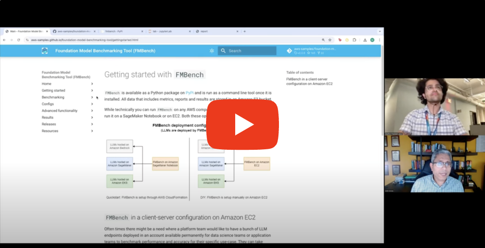
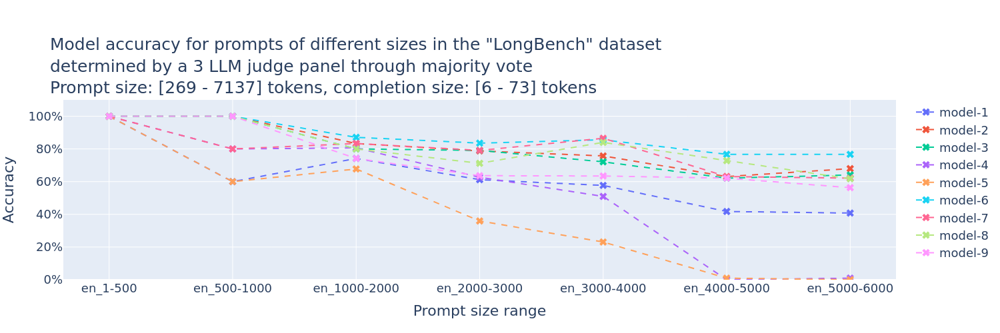

<h1 align="center">
        </img> FMBench
</h1>

<p align="center">
    <p align="center">Benchmark any Foundation Model (FM) on any AWS Generative AI service [Amazon SageMaker, Amazon Bedrock, Amazon EKS, Amazon EC2, or Bring your own endpoint.]
    <br>
</p>
<h4 align="center"><a href="" target="_blank">Amazon Bedrock</a> | <a href="" target="_blank">Amazon SageMaker</a> | <a href="" target="_blank">Amazon EKS</a> | <a href="" target="_blank">Amazon EC2</a></h4>
<h4 align="center">
    <a href="https://pypi.org/project/fmbench/" target="_blank">
        
    </a>    
</h4>


🚨 **What's new**: Quickstart benchmarking on Amazon EC2 with the new [FMBench orchestrator](#running-fmbench-via-the-fmbench-orchestrator) 🚨  

`FMBench` is a Python package for running performance benchmarks and accuracy for **any Foundation Model (FM)** deployed on **any AWS Generative AI service**, be it **Amazon SageMaker**, **Amazon Bedrock**, **Amazon EKS**, or **Amazon EC2**. The FMs could be deployed on these platforms either directly through `FMbench`, or, if they are already deployed then also they could be benchmarked through the **Bring your own endpoint** mode supported by `FMBench`. 

Here are some salient features of `FMBench`:

1. **Highly flexible**: in that it allows for using any combinations of instance types (`g5`, `p4d`, `p5`, `Inf2`), inference containers (`DeepSpeed`, `TensorRT`, `HuggingFace TGI` and others) and parameters such as tensor parallelism, rolling batch etc. as long as those are supported by the underlying platform. 

1. **Benchmark any model**: it can be used to be benchmark _open-source models_, _third party models_, and _proprietary models_ trained by enterprises on their own data. Benchmarking includes both performance benchmaking and model evaluations (accuracy measurement given ground truth). 🚨 **NEW**: Model evaluations done by a **Panel of LLM Evaluators** added in release 2.0.0 🚨

1. **Run anywhere**: it can be run on any AWS platform where we can run Python, such as Amazon EC2, Amazon SageMaker, or even the AWS CloudShell. _It is important to run this tool on an AWS platform so that internet round trip time does not get included in the end-to-end response time latency_.

#### Intro Video

[](https://www.youtube.com/watch?v=yvRCyS0J90c)

#### Determine the optimal price|performance serving stack for your generative AI workload

Use `FMBench` to benchmark an LLM on any AWS generative AI service for price and performance (inference latency, transactions/minute). Here is one of the plots generated by `FMBench` to help answer the price performance question for the `Llama2-13b` model when hosted on Amazon SageMaker (_the instance types in the legend have been blurred out on purpose, you can find them in the actual plot generated on running `FMBench`_).


#### Determine the optimal model for your generative AI workload

Use `FMBench` to determine model accuracy using a panel of LLM evaluators (PoLL [[1]](#1)). Here is one of the plots generated by `FMBench` to help answer the accuracy question for various FMs on Amazon Bedrock (the model ids in the charts have been blurred out on purpose, you can find them in the actual plot generated on running FMBench).




## Models benchmarked

Configuration files are available in the [configs](./src/fmbench/configs) folder for the following models in this repo.

### Llama3 on Amazon SageMaker

Llama3 is now available on SageMaker (read [blog post](https://aws.amazon.com/blogs/machine-learning/meta-llama-3-models-are-now-available-in-amazon-sagemaker-jumpstart/)), and you can now benchmark it using `FMBench`. Here are the config files for benchmarking `Llama3-8b-instruct` and `Llama3-70b-instruct` on `ml.p4d.24xlarge`, `ml.inf2.24xlarge` and `ml.g5.12xlarge` instances.

- [Config file](https://github.com/aws-samples/foundation-model-benchmarking-tool/blob/main/src/fmbench/configs/llama3/8b/config-llama3-8b-instruct-g5-p4d.yml) for `Llama3-8b-instruct` on  `ml.p4d.24xlarge` and `ml.g5.12xlarge`.
- [Config file](https://github.com/aws-samples/foundation-model-benchmarking-tool/blob/main/src/fmbench/configs/llama3/70b/config-llama3-70b-instruct-g5-p4d.yml) for `Llama3-70b-instruct` on  `ml.p4d.24xlarge` and `ml.g5.48xlarge`.
- [Config file](https://github.com/aws-samples/foundation-model-benchmarking-tool/blob/main/src/fmbench/configs/llama3/8b/config-llama3-8b-inf2-g5.yml) for `Llama3-8b-instruct` on  `ml.inf2.24xlarge` and `ml.g5.12xlarge`.

### Full list of benchmarked models


| Model                           | Amazon EC2                     | Amazon SageMaker                           | Amazon Bedrock                     |
|:--------------------------------|:-------------------------------|:-------------------------------------------|:-----------------------------------|
| **Anthropic Claude-3 Sonnet**    |                               |                                           | On-demand, provisioned             |
| **Anthropic Claude-3 Haiku**     |                               |                                           | On-demand                          |
| **Mistral-7b-instruct**          | inf2, trn1                     | g4dn, g5, p3, p4d, p5                       | On-demand                          |
| **Mistral-7b-AWQ**               |                               | p5                                        |                                    |
| **Mixtral-8x7b-instruct**        |                               |                                           | On-demand                          |
| **Llama3.2-1b instruct**         | g5                            |                                           |                                    |
| **Llama3.2-3b instruct**         | g5                            |                                           |                                    |
| **Llama3.1-8b instruct**         | g5, p4d, p4de, p5, p5e, g6e, g6, inf2, trn1        | g4dn, g5, p3, inf2, trn1                     | On-demand                          |
| **Llama3.1-70b instruct**        | p4d, p4de, p5, p5e, g6e, g5, inf2, trn1            | inf2, trn1                                 | On-demand                          |
| **Llama3-8b instruct**           | g5, g6e, inf2, trn1                 | g4dn, g5, p3, inf2, trn1, p4d, p5e             | On-demand                          |
| **Llama3-70b instruct**          | g5                            | g4dn, g5, p3, inf2, trn1, p4d                 | On-demand                          |
| **Llama2-13b chat**              |                               | g4dn, g5, p3, inf2, trn1, p4d                 | On-demand                          |
| **Llama2-70b chat**              |                               | g4dn, g5, p3, inf2, trn1, p4d                 | On-demand                          |
| **NousResearch-Hermes-70b**      |                               | g5, inf2, trn1                            | On-demand                          |
| **Amazon Titan text lite**       |                               |                                           | On-demand                          |
| **Amazon Titan text express**    |                               |                                           | On-demand                          |
| **Cohere Command text**          |                               |                                           | On-demand                          |
| **Cohere Command light text**    |                               |                                           | On-demand                          |
| **AI21 J2 Mid**                  |                               |                                           | On-demand                          |
| **AI21 J2 Ultra**                |                               |                                           | On-demand                          |
| **Gemma-2b**                     |                               | g4dn, g5, p3                                |                                    |
| **Phi-3-mini-4k-instruct**       |                               | g4dn, g5, p3                                |                                    |
| **distilbert-base-uncased**      |                               | g4dn, g5, p3                                |                                    |

## New in this release

## 2.0.21

1. Dynamically get EC2 pricing from Boto3 API.
1. Update pricing information and model id for Amazon Bedrock models.

## 2.0.20
1. Add `hf_tokenizer_model_id` parameter to automatically download tokenizers from Hugging Face.

## 2.0.19
1. Config files for `Llama3.1-1b` on AMD/Intel CPU instance types.
1. Bug fixes for token counting for vLLM.


[Release history](./release_history.md)

## Getting started

`FMBench` is available as a Python package on [PyPi](https://pypi.org/project/fmbench) and is run as a command line tool once it is installed. All data that includes metrics, reports and results are stored in an Amazon S3 bucket. 

> [!IMPORTANT]
> 💡 [All **documentation** for `FMBench` is available on the `FMBench` website](https://aws-samples.github.io/foundation-model-benchmarking-tool/index.html)  

You can run `FMBench` on either a SageMaker notebook or on an EC2 VM. Both options are described [here](https://aws-samples.github.io/foundation-model-benchmarking-tool/gettingstarted.html) as part of the documentation. You can even run `FMBench` as a [Docker container](https://aws-samples.github.io/foundation-model-benchmarking-tool/run_as_container.html) A Quickstart guide for SageMaker is bring provided below as well.

👉 The following sections are discussing running `FMBench` the tool, as different from where the FM is actually deployed. For example, we could run `FMBench` on EC2 but the model being deployed is on SageMaker or even Bedrock. 

### Quickstart

**_FMBench on a Amazon SageMaker Notebook_**

1. Each `FMBench` run works with a configuration file that contains the information about the model, the deployment steps, and the tests to run. A typical `FMBench` workflow involves either directly using an already provided config file from the [`configs`](https://github.com/aws-samples/foundation-model-benchmarking-tool/tree/main/src/fmbench/configs) folder in the `FMBench` GitHub repo or editing an already provided config file as per your own requirements (say you want to try benchmarking on a different instance type, or a different inference container etc.).

    👉 A simple config file with key parameters annotated is included in this repo, see [`config-llama2-7b-g5-quick.yml`](https://github.com/aws-samples/foundation-model-benchmarking-tool/tree/main/src/fmbench/configs/llama2/7b/config-llama2-7b-g5-quick.yml). This file benchmarks performance of Llama2-7b on an `ml.g5.xlarge` instance and an `ml.g5.2xlarge` instance. You can use this config file as it is for this Quickstart.

1. Launch the AWS CloudFormation template included in this repository using one of the buttons from the table below. The CloudFormation template creates the following resources within your AWS account: Amazon S3 buckets, Amazon IAM role and an Amazon SageMaker Notebook with this repository cloned. A read S3 bucket is created which contains all the files (configuration files, datasets) required to run `FMBench` and a write S3 bucket is created which will hold the metrics and reports generated by `FMBench`. The CloudFormation stack takes about 5-minutes to create.

   |AWS Region                |     Link        |
   |:------------------------:|:-----------:|
   |us-east-1 (N. Virginia)    | [](https://console.aws.amazon.com/cloudformation/home?region=us-east-1#/stacks/new?stackName=fmbench&templateURL=https://aws-blogs-artifacts-public.s3.amazonaws.com/artifacts/ML-FMBT/template.yml) |
   |us-west-2 (Oregon)    | [](https://console.aws.amazon.com/cloudformation/home?region=us-west-2#/stacks/new?stackName=fmbench&templateURL=https://aws-blogs-artifacts-public.s3.amazonaws.com/artifacts/ML-FMBT/template.yml) |
   |us-gov-west-1 (GovCloud West)    | [](https://us-gov-west-1.console.amazonaws-us-gov.com/cloudformation/home?region=us-gov-west-1#/stacks/new?stackName=fmbench&templateURL=https://aws-blogs-artifacts-public.s3.amazonaws.com/artifacts/ML-FMBT/template.yml) |

1. Once the CloudFormation stack is created, navigate to SageMaker Notebooks and open the `fmbench-notebook`.

1. On the `fmbench-notebook` open a Terminal and run the following commands.

    ```{.bash}
    conda create --name fmbench_python311 -y python=3.11 ipykernel
    source activate fmbench_python311;
    pip install -U fmbench
    ```

1. Now you are ready to `fmbench` with the following command line. We will use a sample config file placed in the S3 bucket by the CloudFormation stack for a quick first run.
    
    1. We benchmark performance for the `Llama2-7b` model on a `ml.g5.xlarge` and a `ml.g5.2xlarge` instance type, using the `huggingface-pytorch-tgi-inference` inference container. This test would take about 30 minutes to complete and cost about $0.20.
    
    1. It uses a simple relationship of 750 words equals 1000 tokens, to get a more accurate representation of token counts use the `Llama2 tokenizer` (instructions are provided in the next section). ***It is strongly recommended that for more accurate results on token throughput you use a tokenizer specific to the model you are testing rather than the default tokenizer. See instructions provided later in this document on how to use a custom tokenizer***.

        ```{.bash}
        account=`aws sts get-caller-identity | jq .Account | tr -d '"'`
        region=`aws configure get region`
        fmbench --config-file s3://sagemaker-fmbench-read-${region}-${account}/configs/llama2/7b/config-llama2-7b-g5-quick.yml > fmbench.log 2>&1
        ```

    1. Open another terminal window and do a `tail -f` on the `fmbench.log` file to see all the traces being generated at runtime.
    
        ```{.bash}
        tail -f fmbench.log
        ```
        
    1. 👉 For streaming support on SageMaker and Bedrock checkout these config files:
        1. [config-llama3-8b-g5-streaming.yml](src/configs/llama3/8b/config-llama3-8b-g5-streaming.yml)
        1. [config-bedrock-llama3-streaming.yml](src/configs/bedrock/config-bedrock-llama3-streaming.yml)
    
1. The generated reports and metrics are available in the `sagemaker-fmbench-write-<replace_w_your_aws_region>-<replace_w_your_aws_account_id>` bucket. The metrics and report files are also downloaded locally and in the `results` directory (created by `FMBench`) and the benchmarking report is available as a markdown file called `report.md` in the `results` directory. You can view the rendered Markdown report in the SageMaker notebook itself or download the metrics and report files to your machine for offline analysis.

_If you would like to understand what is being done under the hood by the CloudFormation template, see [the DIY version with gory details](./misc/the-diy-version-w-gory-details.md)_

#### `FMBench` on SageMaker in GovCloud

No special steps are required for running `FMBench` on GovCloud. The CloudFormation link for `us-gov-west-1` has been provided in the section above.

1. Not all models available via Bedrock or other services may be available in GovCloud. The following commands show how to run `FMBench` to benchmark the [Amazon Titan Text Express](https://docs.aws.amazon.com/bedrock/latest/userguide/titan-text-models.html#titantx-express) model in the GovCloud. See the [Amazon Bedrock GovCloud](https://docs.aws.amazon.com/govcloud-us/latest/UserGuide/govcloud-bedrock.html) page for more details.

```{.bash}
account=`aws sts get-caller-identity | jq .Account | tr -d '"'`
region=`aws configure get region`
fmbench --config-file s3://sagemaker-fmbench-read-${region}-${account}/configs/bedrock/config-bedrock-titan-text-express.yml > fmbench.log 2>&1
```

## Running `FMBench` via the `FMBench-orchestrator`

**_FMBench on Amazon EC2 via the FMBench orchestrator_**

If you want to benchmark FMs on Amazon EC2 then you can use the [`fmbench-orchestrator`](https://github.com/awslabs/fmbench-orchestrator) as a quick and simple way to get started. The `orchestrator` is a Python program that can be installed on an EC2 machine and it in turn launches other EC2 machines for benchmarking purposes. The orchestrator installs and runs `FMBench` on these EC2 machines, downloads the benchmarking result from these machines and finally terminates these machines once the benchmarking finished.

As an example, consider a scenario that you want to benchmark say the `Llama3.1-8b` model on a `g5.2xlarge`, `g6.2xlarge`, `p4d.24xlarge`, `p5e.48xlarge` and a `trn1.32xlarge`. Usually this would mean that you have to create these EC2 instances, install the pre-requisites, installed FMBench, run FMBench, download the results and then repeat the process for the next instance. This is tedious work. The orchestrator makes this super convenient by doing all this for you and doing this in parallel. It will spawn all these EC2 VMs and do all the steps mentioned above and at the end of the test you will have results from all the instances downloaded on the orchestrator VM and all the EC2 VMs that were spawned would have automatically been terminated. See the [`orchestrator README`](https://github.com/awslabs/fmbench-orchestrator?tab=readme-ov-file#overview) for more details.


## Results

Depending upon the experiments in the config file, the `FMBench` run may take a few minutes to several hours. Once the run completes, you can find the report and metrics in the local `results-*` folder in the directory from where `FMBench` was run. The rpeort and metrics are also written to the write S3 bucket set in the [config file](https://github.com/aws-samples/foundation-model-benchmarking-tool/blob/main/src/fmbench/configs/config-mistral-7b-tgi-g5.yml#L12).

Here is a screenshot of the `report.md` file generated by `FMBench`.


## Benchmark models deployed on different AWS Generative AI services ([Docs](https://aws-samples.github.io/foundation-model-benchmarking-tool/benchmarking.html))

`FMBench` comes packaged with configuration files for benchmarking models on different AWS Generative AI services i.e. Bedrock, SageMaker, EKS and EC2 or bring your own endpoint even.

# Enhancements

View the [ISSUES](https://github.com/aws-samples/foundation-model-benchmarking-tool/issues) on GitHub and add any you might think be an beneficial iteration to this benchmarking harness.

## Security

See [CONTRIBUTING](CONTRIBUTING.md#security-issue-notifications) for more information.

## License

This library is licensed under the MIT-0 License. See the [LICENSE](./LICENSE) file.

## Star History

[](https://star-history.com/#aws-samples/foundation-model-benchmarking-tool&Date)

[](https://github.com/aws-samples/foundation-model-benchmarking-tool/stargazers)

## Support

- Schedule Demo 👋 - send us an email 🙂
- [Community Discord 💭](https://discord.gg/ydXV8mYFtF)
- Our emails ✉️ aroraai@amazon.com / madhurpt@amazon.com


## Contributors

<a href="https://github.com/aws-samples/foundation-model-benchmarking-tool/graphs/contributors">
  
</a>

## References
<a id="1">[1]</a> 
[Pat Verga et al., "Replacing Judges with Juries: Evaluating LLM Generations with a Panel of Diverse Models",    arXiv:2404.18796, 2024.](https://arxiv.org/abs/2404.18796)
