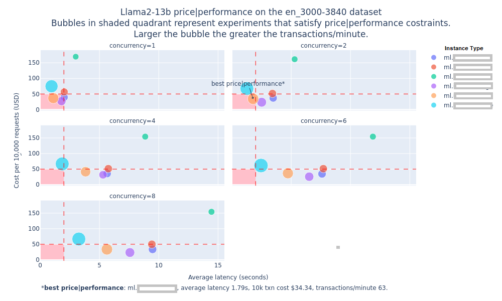

# Foundation Model benchmarking tool (FMBT) built using Amazon SageMaker

A key challenge with FMs is the ability to benchmark their performance in terms of inference latency, throughput and cost so as to determine which model running with what combination of the hardware and serving stack provides the best price-performance combination for a given workload.

Stated as **business problem**, the ask is “_*What is the dollar cost per transaction for a given generative AI workload that serves a given number of users while keeping the response time under a target threshold?*_”

But to really answer this question, we need to answer an **engineering question** (an optimization problem, actually) corresponding to this business problem: “*_What is the minimum number of instances N, of most cost optimal instance type T, that are needed to serve a workload W while keeping the average transaction latency under L seconds?_*”

*W: = {R transactions per-minute, average prompt token length P, average generation token length G}*

This foundation model benchmarking tool (a.k.a. `FMBT`) is a tool to answer the above engineering question and thus answer the original business question about how to get the best price performance for a given workload. Here is one of the plots generated by `FMBT` to help answer the above question (_the numbers on the y-axis, transactions per minute and latency have been removed from the image below, you can find them in the actual plot generated on running `FMBT`_).



## Description

The `FMBT` is a Python based tool to benchmark performance of **any model** on **any supported instance type** (`g5`, `p4d`, `Inf2`). We deploy models on Amazon SageMaker and use the endpoint to send inference requests to and measure metrics such as inference latency, error rate, transactions per second etc. for different combinations of instance type, inference container and settings such as tensor parallelism etc. Because `FMBT` works for any model therefore it can be used not only testing _third party models_ available on SageMaker, _open-source models_ but also _proprietary models_ trained by enterprises on their own data.

`FMBT` can be run on any platform that supports Jupyter Notebooks (such as SageMaker, AWS Cloud9 and others) or containers (Amazon EC2, Amazon EKS, AWS Fargate). It is important to run this tool on an AWS platform so that internet round trip time does not get included in the end-to-end response time latency.

>In a production system you may choose to deploy models outside of SageMaker such as on EC2 or EKS but even in those scenarios the benchmarking results from this tool can be used as a guide for determining the optimal instance type and serving stack (inference containers, configuration).

The workflow for `FMBT` is as follows:

```
Create configuration file
        |
        |-----> Deploy model on SageMaker
                    |
                    |-----> Run inference against deployed endpoint(s)
                                     |
                                     |------> Run code for report creation within your s3 bucket automatically
```


1. Create a dataset of different prompt sizes and select one or more such datasets for running the tests.
    1. Currently use datasets from [LongBench](https://github.com/THUDM/LongBench) and filter out individual items from the dataset based on their size in tokens (for example, prompts less than 500 tokens, between 500 to 1000 tokens and so on and so forth).

1. Deploy **any model** that is deployable on SageMaker on **any supported instance type** (`g5`, `p4d`, `Inf2`).
    1. Models could be either available via SageMaker JumpStart (list available [here](https://sagemaker.readthedocs.io/en/stable/doc_utils/pretrainedmodels.html)) as well as models not available via JumpStart but still deployable on SageMaker through the low level boto3 (Python) SDK (Bring Your  Own Script).
    1. Model deployment is completely configurable in terms of the inference container to use, environment variable to set, `setting.properties` file to provide (for inference containers such as DJL that use it) and instance type to use.

1. Benchmark FM performance in terms of inference latency, transactions per minute and dollar cost per transaction for any FM that can be deployed on SageMaker.
    1. Tests are run for each combination of the configured concurrency levels i.e. transactions (inference requests) sent to the endpoint in parallel and dataset. For example, run multiple datasets of say prompt sizes between 3000 to 4000 tokens at concurrency levels of 1, 2, 4, 6, 8 etc. so as to test how many transactions of what token length can the endpoint handle while still maintaining an acceptable level of inference latency.

1. Generate a report comparing and contrasting the performance of the models over different test configurations within your aws s3 bucket.
    1. The report is generated in the [Markdown](https://en.wikipedia.org/wiki/Markdown) format within your s3 bucket and consists of plots, tables and text that highlight the key results and provide an overall recommendation on what is the best combination of instance type and serving stack to use for the model under stack for a dataset of interest.
    1. The report is created as an artifact of reproducible research so that anyone having access to the model, instance type and serving stack can run the code and recreate the same results and report.

1. Multiple [configuration files](https://github.com/aws-samples/jumpstart-models-benchmarking-test-harness/tree/main/configs) that can be used as reference for benchmarking new models and instance types.

## Getting started

The code is a collection of Jupyter Notebooks that are run in a sequence to benchmark a desired model on a desired set of instance types. All data, metrics and results are managed and configured via s3 automatically.

### Prerequisites

Follow the prerequisites below to set up your environment before running the code:

1. This code requires Python 3.11. If you are using SageMaker for running this code then select `Data Science 3.0` kernel for your SageMaker notebooks.

1. **Data Ingestion via S3** : Configure two buckets within your aws account: 

    * A ***read bucket*** that will contain the `tokenizer files`, `prompt template`, `source/raw data` and `scripts` (in bring your own model case). This bucket will be responsible only for read actions on data that needs to be used in writing metrics and results to the second ***write bucket***. 
    
    * With the ***write bucket***, as you run the harness, all data will be read from the read bucket and tests, metrics and reports will automatically be generated in an organized way within the write bucket after each run. 

* **The ***read bucket*** will have the following contents**: 

    1. **Tokenizer Directory**:  We currently use the `Llama 2 Tokenizer` for counting prompt and generation tokens. Now you can also use your own custom tokenizer by downloading the  tokenizer files and running it using the `autotokenizer` function from hugging face. 
    
    The use of the LLama2 model is governed by the Meta license. In order to download the tokenizer, visit the website and accept the License before requesting access here: [meta approval form](https://ai.meta.com/resources/models-and-libraries/llama-downloads/).   

    * Create a directory called "Tokenizer" (flexible to change) in your ***S3 read bucket***. Bring the tokenizer files for your specific model.  Once you have configured these files in this directory, the `FMBT` harness will execute and process your custom tokenizer logic for you. This directory should contain the files below:

        * `tokenizer.json`
        * `config.json`


    2. **Source Data Directory**: Create a `source data` directory storing the dataset you want to use to benchmark with. `FMBT` uses `Q&A` datasets from the [`LongBench dataset`](https://github.com/THUDM/LongBench). _Support for bring your own dataset will be added soon_.

        * Download the different files specified in the [LongBench dataset](https://github.com/THUDM/LongBench) into the `data/dataset` directory. Following is a good list to get started with:

            * `2wikimqa`
            * `hotpotqa`
            * `narrativeqa`
            * `triviaqa`

        * Once you have uploaded this data and started the run, `FMBT` will read this data from the ***read bucket*** and create payloads of different sizes (that can be configured by you) and write those processed payloads in the ***write bucket*** for further steps.

    3. **Prompt Template Directory**: Create a `prompt template` directory storing a `prompt_template.txt` file (configurable via the config files). This file will contain the prompt template that your specific model supports and prepare the payloads with this prompt template for inference purposes. `FMBT` already supports prompts compatible with the `Llama` models.

    4. **Scripts Directory**: `Deploying models not natively available via SageMaker JumpStart` - for deploying models that are not natively available via SageMaker JumpStart i.e. anything not included in [this](https://sagemaker.readthedocs.io/en/stable/doc_utils/pretrainedmodels.html) list `FMBT` also supports a `bring your own script (BYOS)` mode. Here are the steps to use BYOS.

        1. Create a Python script to deploy your model on a SageMaker endpoint. This script needs to have a `deploy` function that [`1_deploy_model.ipynb`](./1_deploy_model.ipynb) can invoke. See [`p4d_hf_tgi.py`](./scripts/p4d_hf_tgi.py) for reference.

        1. Place your deployment script in the `scripts` directory within your ***read bucket***. Add any associated `settings.properties` file in the same directory. 

            * If your script deploys a model directly from HuggingFace and needs to have access to a HuggingFace auth token, then create a file called `hf_token.txt` and put the auth token in that file. The [`.gitignore`](.gitgnore) file in this repo has rules to not commit the `hf_token.txt` to the repo. `FMBT` is already compatible with:

                * All models deployable via SageMaker Jumpstart
                * Models deployable via the `HF TGI container`
                * Models deployable via the `Deep Java Library container`

    
* **The ***write bucket*** will be created by you, and all metrics, reports and results will be generated in your account.** Once you have configured both buckets, your environment structure should be as follows:

```
Create S3 Read Bucket - Configurable from the Config files
        |
        |-----> Create directories for: (i)Tokenizer (contains tokenizer.json, config.json), (ii)Source data, (iii)Scripts, (iv)Prompt Template
        

        |
        | Execute the code
        V
        

S3 Write Bucket - Configurable from the Config files       
        |
        |-----> Your test run's name directory (generated programmatically with metrics)
            |
            |-----> Data/
                |
                |-----> (i) Metrics (year (yyyy), month (mm), date (dd), hour (hh) format), (ii) Prompts (contains payloads of varying sizes), (iii) Models(deployed endpoint configurations)
```

### Steps to run

1. The `FMBT` is currently intended to run on SageMaker (or any other compute platform where Python 3.11 and JupyterLab can be installed).

1. Clone the [`FMBT`](https://github.com/aws-samples/jumpstart-models-benchmarking-test-harness.git) code repo (you would likely want to fork the repo to create your own copy).

1. Create a config file in the [configs](https://github.com/aws-samples/jumpstart-models-benchmarking-test-harness/tree/main/configs) directory.
    1. The configuration file is a YAML file containing configuration for all steps of the benchmarking process. It is recommended to create a copy of an existing config file and tweak it as necessary to create a new one for your experiment.
    1. Change the config file name in the [config_filename.txt](https://github.com/aws-samples/jumpstart-models-benchmarking-test-harness/blob/main/config_filepath.txt) to point to your config file.

1. Create the read and write buckets as mentioned above. Mention the respective directories for your read and write buckets within the `configs` files. 

1. Run the [`0_setup.ipynb`](https://github.com/aws-samples/jumpstart-models-benchmarking-test-harness/blob/main/0_setup.ipynb) to install the required [Python packages](https://github.com/aws-samples/jumpstart-models-benchmarking-test-harness/blob/main/requirements.txt).

1. Setup your custom tokenizer and datasets needed for download as per instructions in this [README](https://github.com/aws-samples/jumpstart-models-benchmarking-test-harness/tree/main?tab=readme-ov-file#solution-prerequisites).

1. Run the [`1_generate_data.ipynb`](https://github.com/aws-samples/jumpstart-models-benchmarking-test-harness/blob/main/1_generate_data.ipynb) to create the prompt payloads ready for testing. The generated prompt payloads will be written within the `metrics` directory in your ***write s3 bucket***.

1. Run the [`2_deploy_model.ipynb`](https://github.com/aws-samples/jumpstart-models-benchmarking-test-harness/blob/main/2_deploy_model.ipynb) to deploy models on different endpoints with the desired configuration as per the configuration file.
    1. If you are using a model not supported through JumpStart than you can place your deployment script in the [scripts] directory within your `scripts` directory in the ***read bucket*** within s3 and set the deployment script name in the configuration file. Your deployment script needs to have a `deploy_model` that the `FMBT` code will call to deploy the model (refer to existing scripts in the scripts director for reference).
    1. Information on deployed model endpoints will be recorded within the `model` directory in your s3 ***write bucket***.

1. Run the [`3_run_inference.ipynb`](https://github.com/aws-samples/jumpstart-models-benchmarking-test-harness/blob/main/3_run_inference.ipynb) to run inference on the deployed endpoints and collect metrics. These metrics are saved in the metrics directory (these raw metrics are not checked in back into the repo) within your configured s3 ***write bucket*** `metrics` file in your aws account.

1. Run the [`4_model_metric_analysis.ipynb`](https://github.com/aws-samples/jumpstart-models-benchmarking-test-harness/blob/main/4_model_metric_analysis.ipynb) to create statistical summaries, plots, tables and a `final report` for the test results. The reports, metrics and plots will be generated within your `metrics` directory in your ***write bucket***.

1. Run the [`5_cleanup.ipynb`](https://github.com/aws-samples/jumpstart-models-benchmarking-test-harness/blob/main/5_cleanup.ipynb) to delete the deployed endpoints.

## Results

Here is a screenshot of the `report.md` file generated by `FMBT`.


## Pending enhancements

The following enhancements are identified as next steps for `FMBT`.

1. [**Highest priority**] Containerize `FMBT` and provide instructions for running the container on EC2.

1. Add code to determine the cost of running an entire experiment and include it in the final report. This would only include the cost of running the SageMaker endpoints based on hourly public pricing (the cost of running this code on a notebook or a EC2 is trivial in comparison and can be ignored).

1. Support for a custom token counter. Currently only the LLama tokenizer is supported but we want to allow users to bring their own token counting logic for different models.

1. Support for different payload formats that might be needed for different inference containers. Currently the HF TGI container, and DJL Deep Speed container on SageMaker both use the same format but in future other containers might need a different payload format.

1. Emit live metrics so that they can be monitored through Grafana via live dashboard.

View the [ISSUES](https://github.com/aws-samples/foundation-model-benchmarking-tool/issues) on github and add any you might think be an beneficial iteration to this benchmarking harness.

## Security

See [CONTRIBUTING](CONTRIBUTING.md#security-issue-notifications) for more information.

## License

This library is licensed under the MIT-0 License. See the [LICENSE](./LICENSE) file.
