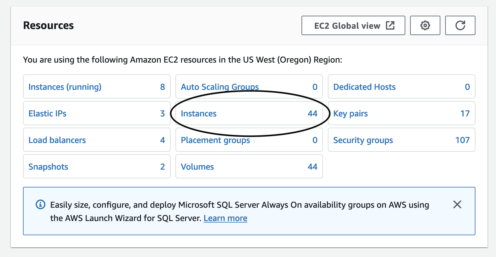
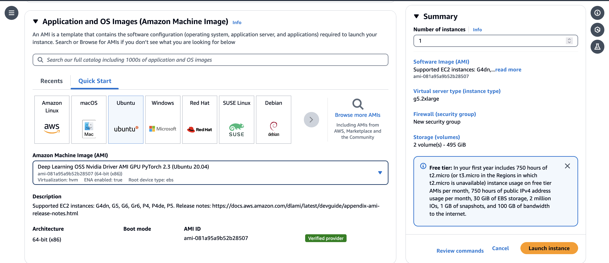
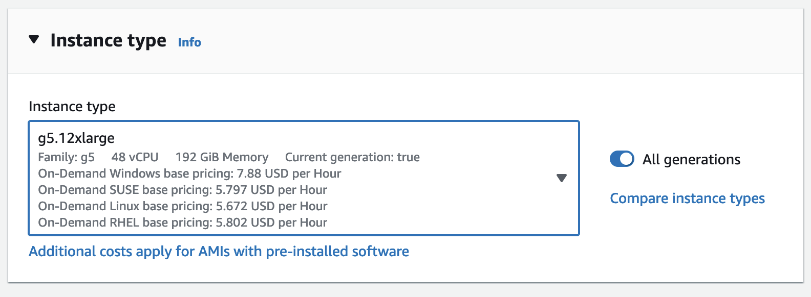
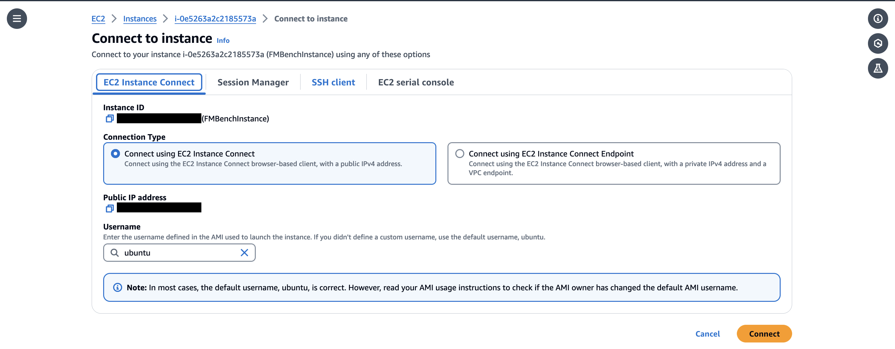

# Run `FMBench` on Amazon EC2 with no dependency on Amazon S3

## Overview

The goal of this document is for the user to be able to create an EC2 instance suitable for LMI (Large Model Inference).

### Creating EC2 Instance

1. On the homepage of AWS Console go to ‘EC2’ - it is likely in recently visited:
   

3. If not found, go to the search bar on the top of the page. Type `ec2` into the search box and click the entry that pops up with name `EC2` :
   

3. Click “Instances”:
   

5. Click "Launch Instances":
   

5. Type in a name for your instance (recommended to include your alias in the name), and then scroll down. Search for ‘deep learning ami’ in the box. (An AMI is an “Amazon Machine Image”, which comes pre-loaded with software.)

Select one that says “Deep Learning OSS Nvidia Driver AMI GPU PyTorch”. **Your version number might be different.** 
    

6. Name your instance "FMBenchInstance"

### Instance Type

7. Scroll down to “Instance Type”. For large model inference, the g5.12xlarge is recommended. (Note: Don’t be confused, the g5.2xlarge and the g5.4xlarge only have ONE gpu, not two or four. g5.12xlarge, on the other hand, has 4.)
   

### Make a key pair

8. Make a key pair by clicking “Create new key pair”. Give it a name, keep all settings as is, and then click “Create key pair”.
   
### Configure storage

Skip over “Network settings” (leave it as it is), going straight to “Configure storage”. 60 GB, the suggested amount, is not nearly enough, and using that will cause the LMI docker container to download for an arbitrarily long time and then error out. Change it to 100 GB or more:
    

9. Then, we’re done with the settings of the instance. Click “Launch Instance” to finish. You can connect to your EC2 instance using any of these option
    

### IAM Role
10. Create an IAM role to your instance called **FmbenchEc2Role**
    * Attach the following permission policies: [AmazonSageMakerFullAccess](https://us-east-1.console.aws.amazon.com/iam/home?region=us-east-1#/policies/details/arn%3Aaws%3Aiam%3A%3Aaws%3Apolicy%2FAmazonSageMakerFullAccess)

Edit the trust policy to be the following:
```
{
    "Version": "2012-10-17",
    "Statement": [
        {
            "Effect": "Allow",
            "Principal": {
                "Service": "ec2.amazonaws.com"
            },
            "Action": "sts:AssumeRole"
        },
        {
            "Effect": "Allow",
            "Principal": {
                "Service": "sagemaker.amazonaws.com"
            },
            "Action": "sts:AssumeRole"
        }
    ]
}
```

# **Connect to instance**
1. After connecting to your instance using any of the options in EC2 (SSH/EC2 Connect), run the following in the EC2 terminal
     ```
    pip install poetry
    curl -O https://repo.anaconda.com/archive/Anaconda3-2023.09-0-Linux-x86_64.sh
    ```
1. Clone the [`FMBench`](https://github.com/aws-samples/foundation-model-benchmarking-tool) repo from GitHub on your EC2 instance.

    ```{.bash}
    git clone https://github.com/aws-samples/foundation-model-benchmarking-tool.git
    cd foundation-model-benchmarking-tool
    ```

1. Setup the `fmbench_python311` conda environment. This step required conda to be installed on the EC2 instance, see [instructions](https://www.anaconda.com/download) for downloading Anaconda.

    ```{.bash}
    conda create --name fmbench_python311 -y python=3.11 ipykernel
    source activate fmbench_python311;
    pip install -U fmbench
    ```

1. Create local directory structure needed for `FMBench` and copy all publicly available dependencies from the AWS S3 bucket for `FMBench`. This is done by running the `copy_s3_content.sh` script available as part of the `FMBench` repo.

    ```{.bash}
    ./copy_s3_content.sh
    ```

1. Run `FMBench` with a quickstart config file.

    ```{.bash}
    fmbench --config-file /tmp/fmbench-read/configs/byoe/config-byo-ec2-rest-ep-llama3-8b.yml --local-mode yes >> fmbench.log 2>&1
    ```

1. Open a new Terminal and navigate to the `foundation-model-benchmarking-tool` directory and do a `tail` on `fmbench.log` to see a live log of the run.

    ```{.bash}
    tail -f fmbench.log
    ```

1. All metrics are stored in the `/tmp/fmbench-write` directory created automatically by the `fmbench` package. Once the run completes all files are copied locally in a `results-*` folder as usual.
