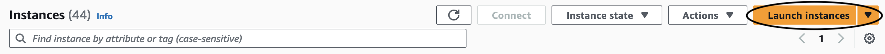

# FMbench on EC2

## Creating an EC2 Instance

### Overview

The goal of this document is for the user to be able to create an EC2 instance suitable for LMI (Large Model Inference).

## Creating EC2 Instance

On the homepage of AWS Console go to ‘EC2’ - it is likely in recently visited:


If not found, go to the search bar on the top of the page. Type `ec2` into the search box and click the entry that pops up with name `EC2` :


Click “Instances”:


Click "Launch Instances":


Type in a name for your instance (recommended to include your alias in the name), and then scroll down. Search for ‘deep learning ami’ in the box. (An AMI is an “Amazon Machine Image”, which comes pre-loaded with software.)

Select one that says “Deep Learning OSS Nvidia Driver AMI GPU PyTorch”. **Your version number might be different.** 


Name your instance "FMBenchInstance"

### Instance Type

Scroll down to “Instance Type”. For large model inference, the g5.12xlarge is recommended. (Note: Don’t be confused, the g5.2xlarge and the g5.4xlarge only have ONE gpu, not two or four. g5.12xlarge, on the other hand, has 4.)


[Image: Image.jpg]
### Make a key pair

Make a key pair by clicking “Create new key pair”. Give it a name, keep all settings as is, and then click “Create key pair”.

### Configure storage

Skip over “Network settings” (leave it as it is), going straight to “Configure storage”. 60 GB, the suggested amount, is not nearly enough, and using that will cause the LMI docker container to download for an arbitrarily long time and then error out. Change it to 100 GB or more:


### Advanced Details
Go to the advanced details section in you ec2 and enter the following in EC2 User-data:

```
#install poetry in EC2 Instance
pip install poetry
curl -O https://repo.anaconda.com/archive/Anaconda3-2023.09-0-Linux-x86_64.sh
```

Then, we’re done with the settings of the instance. Click “Launch Instance” to finish. You can connect to your EC2 instance using any of these option


IAM Role
Attach an IAM role to your instance called **FmbenchEc2Role 
**

Attach the following permission policies: [AmazonSageMakerFullAccess](https://us-east-1.console.aws.amazon.com/iam/home?region=us-east-1#/policies/details/arn%3Aaws%3Aiam%3A%3Aaws%3Apolicy%2FAmazonSageMakerFullAccess)

Edit the trust policy to be the following:
```
{
    "Version": "2012-10-17",
    "Statement": [
        {
            "Effect": "Allow",
            "Principal": {
                "Service": "ec2.amazonaws.com"
            },
            "Action": "sts:AssumeRole"
        },
        {
            "Effect": "Allow",
            "Principal": {
                "Service": "sagemaker.amazonaws.com"
            },
            "Action": "sts:AssumeRole"
        }
    ]
}
```

# **Connect to instance**

After connecting to your instance using any of the options in EC2 (ssh/ec2 connect), follow steps 1-4 in section on FMbench
[Run `FMBench` on Amazon EC2 with no dependency on Amazon S3](https://github.com/aws-samples/foundation-model-benchmarking-tool/tree/ec2-deployment?tab=readme-ov-file#run-fmbench-on-amazon-ec2-with-no-dependency-on-amazon-s3)

Then run the following in the EC2 terminal

```
fmbench --config-file /home/ubuntu/foundation-model-benchmarking-tool/src/fmbench/configs/byoe/config-byo-ec2-rest-ep-llama3-8b.yml --local-mode yes --write-bucket {a_s3_bucket} >> fmbenchLocal.log 2>&1
```
