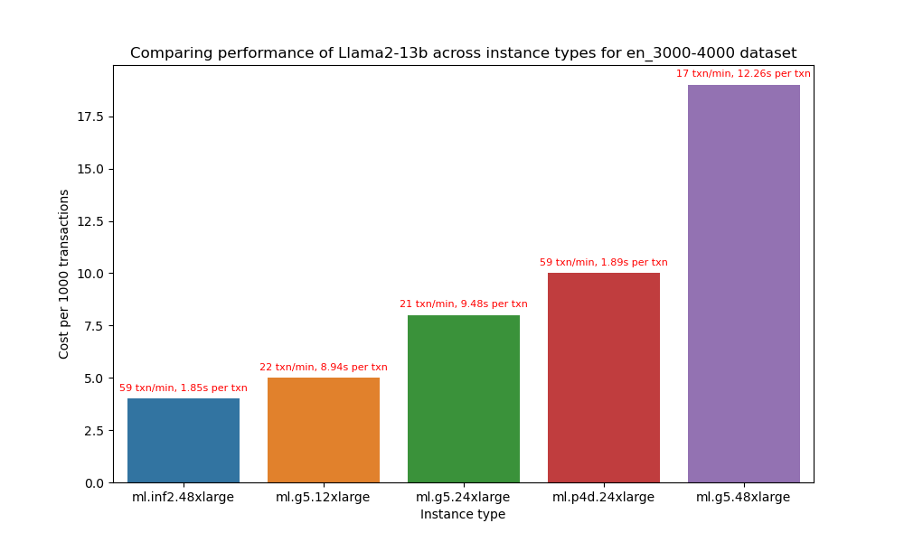
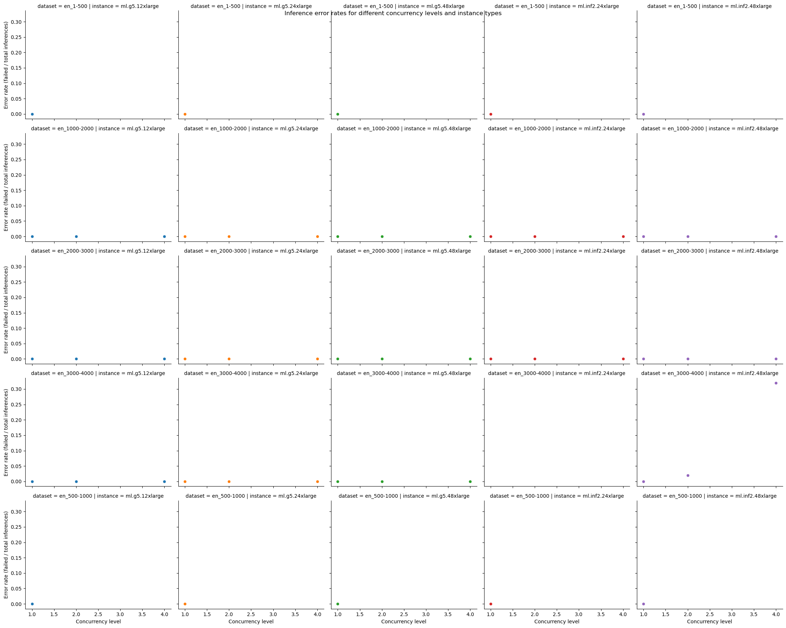
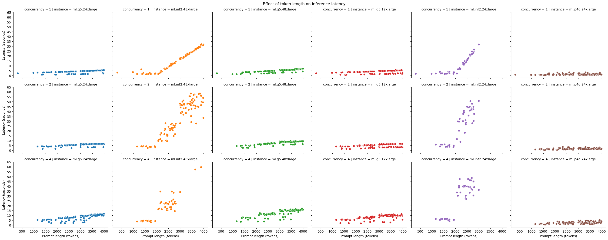
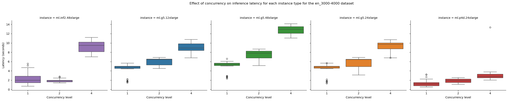

# Results for performance benchmarking

**Last modified (UTC): 2024-01-23 22:39:51.872281**

## Summary

We did performance benchmarking for the `Llama2-13b` model on "`ml.g5.12xlarge`, `ml.g5.24xlarge`, `ml.g5.48xlarge`, `ml.inf2.24xlarge`, `ml.inf2.48xlarge`, `ml.p4d.24xlarge`" instances on multiple datasets and based on the test results the best price performance for dataset `en_3000-4000` is provided by the `ml.inf2.48xlarge` instance type.  

| Information | Value |
|-----|-----|
| experiment_name | llama2-13b-inf2.48xlarge-djl-0.24.0-neuronx-sdk-2.14.1-bs=4-tpd=24 |
| payload_file | payload_en_3000-4000.jsonl |
| instance_type | ml.inf2.48xlarge |
| concurrency | 2 |
| error_rate | 0.0 |
| prompt_token_count_mean | 3474 |
| prompt_token_throughput | 3420 |
| completion_token_count_mean | 29 |
| completion_token_throughput | 26 |
| latency_mean | 1.9 |
| transactions_per_minute | 58 |
| price_per_hour | 15.58 |
| price_per_txn | 0.0045 |

The price performance comparison for different instance types is presented below:

The configuration used for these tests is available in the [`config`](config-llama2-13b-inf2-g5-p4d-v1.yml) file.

## Per instance results

The following table provides the best combinations for running inference for different sizes prompts on different instance types.

|Dataset   | Instance type   | Recommendation   |
|---|---|---|
|`payload_en_1-500.jsonl`|`ml.g5.12xlarge`|The best option for staying within a latency budget of `20 seconds` on a `ml.g5.12xlarge` for the `payload_en_1-500.jsonl` dataset is a `concurrency level of 4`. A concurrency level of 4 achieves an `average latency of 1.73 seconds`, for an `average prompt size of 304 tokens` and `completion size of 55 tokens` with `87 transactions/minute`.|
|`payload_en_1000-2000.jsonl`|`ml.g5.12xlarge`|The best option for staying within a latency budget of `20 seconds` on a `ml.g5.12xlarge` for the `payload_en_1000-2000.jsonl` dataset is a `concurrency level of 4`. A concurrency level of 4 achieves an `average latency of 5.39 seconds`, for an `average prompt size of 1641 tokens` and `completion size of 90 tokens` with `39 transactions/minute`.|
|`payload_en_2000-3000.jsonl`|`ml.g5.12xlarge`|The best option for staying within a latency budget of `20 seconds` on a `ml.g5.12xlarge` for the `payload_en_2000-3000.jsonl` dataset is a `concurrency level of 4`. A concurrency level of 4 achieves an `average latency of 6.82 seconds`, for an `average prompt size of 2503 tokens` and `completion size of 81 tokens` with `28 transactions/minute`.|
|`payload_en_3000-4000.jsonl`|`ml.g5.12xlarge`|The best option for staying within a latency budget of `20 seconds` on a `ml.g5.12xlarge` for the `payload_en_3000-4000.jsonl` dataset is a `concurrency level of 4`. A concurrency level of 4 achieves an `average latency of 9.0 seconds`, for an `average prompt size of 3468 tokens` and `completion size of 84 tokens` with `22 transactions/minute`.|
|`payload_en_500-1000.jsonl`|`ml.g5.12xlarge`|The best option for staying within a latency budget of `20 seconds` on a `ml.g5.12xlarge` for the `payload_en_500-1000.jsonl` dataset is a `concurrency level of 4`. A concurrency level of 4 achieves an `average latency of 4.2 seconds`, for an `average prompt size of 980 tokens` and `completion size of 102 tokens` with `57 transactions/minute`.|
|`payload_en_1-500.jsonl`|`ml.g5.24xlarge`|The best option for staying within a latency budget of `20 seconds` on a `ml.g5.24xlarge` for the `payload_en_1-500.jsonl` dataset is a `concurrency level of 4`. A concurrency level of 4 achieves an `average latency of 1.75 seconds`, for an `average prompt size of 304 tokens` and `completion size of 57 tokens` with `87 transactions/minute`.|
|`payload_en_1000-2000.jsonl`|`ml.g5.24xlarge`|The best option for staying within a latency budget of `20 seconds` on a `ml.g5.24xlarge` for the `payload_en_1000-2000.jsonl` dataset is a `concurrency level of 4`. A concurrency level of 4 achieves an `average latency of 5.08 seconds`, for an `average prompt size of 1641 tokens` and `completion size of 82 tokens` with `39 transactions/minute`.|
|`payload_en_2000-3000.jsonl`|`ml.g5.24xlarge`|The best option for staying within a latency budget of `20 seconds` on a `ml.g5.24xlarge` for the `payload_en_2000-3000.jsonl` dataset is a `concurrency level of 4`. A concurrency level of 4 achieves an `average latency of 6.87 seconds`, for an `average prompt size of 2503 tokens` and `completion size of 83 tokens` with `29 transactions/minute`.|
|`payload_en_3000-4000.jsonl`|`ml.g5.24xlarge`|The best option for staying within a latency budget of `20 seconds` on a `ml.g5.24xlarge` for the `payload_en_3000-4000.jsonl` dataset is a `concurrency level of 4`. A concurrency level of 4 achieves an `average latency of 9.14 seconds`, for an `average prompt size of 3468 tokens` and `completion size of 86 tokens` with `21 transactions/minute`.|
|`payload_en_500-1000.jsonl`|`ml.g5.24xlarge`|The best option for staying within a latency budget of `20 seconds` on a `ml.g5.24xlarge` for the `payload_en_500-1000.jsonl` dataset is a `concurrency level of 4`. A concurrency level of 4 achieves an `average latency of 3.55 seconds`, for an `average prompt size of 980 tokens` and `completion size of 78 tokens` with `57 transactions/minute`.|
|`payload_en_1-500.jsonl`|`ml.g5.48xlarge`|The best option for staying within a latency budget of `20 seconds` on a `ml.g5.48xlarge` for the `payload_en_1-500.jsonl` dataset is a `concurrency level of 4`. A concurrency level of 4 achieves an `average latency of 2.86 seconds`, for an `average prompt size of 304 tokens` and `completion size of 102 tokens` with `83 transactions/minute`.|
|`payload_en_1000-2000.jsonl`|`ml.g5.48xlarge`|The best option for staying within a latency budget of `20 seconds` on a `ml.g5.48xlarge` for the `payload_en_1000-2000.jsonl` dataset is a `concurrency level of 4`. A concurrency level of 4 achieves an `average latency of 6.84 seconds`, for an `average prompt size of 1641 tokens` and `completion size of 89 tokens` with `32 transactions/minute`.|
|`payload_en_2000-3000.jsonl`|`ml.g5.48xlarge`|The best option for staying within a latency budget of `20 seconds` on a `ml.g5.48xlarge` for the `payload_en_2000-3000.jsonl` dataset is a `concurrency level of 4`. A concurrency level of 4 achieves an `average latency of 9.06 seconds`, for an `average prompt size of 2503 tokens` and `completion size of 81 tokens` with `22 transactions/minute`.|
|`payload_en_3000-4000.jsonl`|`ml.g5.48xlarge`|The best option for staying within a latency budget of `20 seconds` on a `ml.g5.48xlarge` for the `payload_en_3000-4000.jsonl` dataset is a `concurrency level of 4`. A concurrency level of 4 achieves an `average latency of 12.82 seconds`, for an `average prompt size of 3468 tokens` and `completion size of 86 tokens` with `16 transactions/minute`.|
|`payload_en_500-1000.jsonl`|`ml.g5.48xlarge`|The best option for staying within a latency budget of `20 seconds` on a `ml.g5.48xlarge` for the `payload_en_500-1000.jsonl` dataset is a `concurrency level of 4`. A concurrency level of 4 achieves an `average latency of 4.83 seconds`, for an `average prompt size of 980 tokens` and `completion size of 102 tokens` with `49 transactions/minute`.|
|`payload_en_1-500.jsonl`|`ml.inf2.24xlarge`|The best option for staying within a latency budget of `20 seconds` on a `ml.inf2.24xlarge` for the `payload_en_1-500.jsonl` dataset is a `concurrency level of 4`. A concurrency level of 4 achieves an `average latency of 3.74 seconds`, for an `average prompt size of 304 tokens` and `completion size of 25 tokens` with `63 transactions/minute`.|
|`payload_en_1000-2000.jsonl`|`ml.inf2.24xlarge`|The best option for staying within a latency budget of `20 seconds` on a `ml.inf2.24xlarge` for the `payload_en_1000-2000.jsonl` dataset is a `concurrency level of 4`. A concurrency level of 4 achieves an `average latency of 5.42 seconds`, for an `average prompt size of 1641 tokens` and `completion size of 66 tokens` with `36 transactions/minute`.|
|`payload_en_2000-3000.jsonl`|`ml.inf2.24xlarge`|The best option for staying within a latency budget of `20 seconds` on a `ml.inf2.24xlarge` for the `payload_en_2000-3000.jsonl` dataset is a `concurrency level of 4`. A concurrency level of 4 achieves an `average latency of 5.4 seconds`, for an `average prompt size of 2503 tokens` and `completion size of 65 tokens` with `34 transactions/minute`.|
|`payload_en_500-1000.jsonl`|`ml.inf2.24xlarge`|The best option for staying within a latency budget of `20 seconds` on a `ml.inf2.24xlarge` for the `payload_en_500-1000.jsonl` dataset is a `concurrency level of 4`. A concurrency level of 4 achieves an `average latency of 3.37 seconds`, for an `average prompt size of 980 tokens` and `completion size of 16 tokens` with `70 transactions/minute`.|
|`payload_en_1-500.jsonl`|`ml.inf2.48xlarge`|The best option for staying within a latency budget of `20 seconds` on a `ml.inf2.48xlarge` for the `payload_en_1-500.jsonl` dataset is a `concurrency level of 4`. A concurrency level of 4 achieves an `average latency of 3.15 seconds`, for an `average prompt size of 304 tokens` and `completion size of 24 tokens` with `75 transactions/minute`.|
|`payload_en_1000-2000.jsonl`|`ml.inf2.48xlarge`|The best option for staying within a latency budget of `20 seconds` on a `ml.inf2.48xlarge` for the `payload_en_1000-2000.jsonl` dataset is a `concurrency level of 4`. A concurrency level of 4 achieves an `average latency of 4.54 seconds`, for an `average prompt size of 1641 tokens` and `completion size of 65 tokens` with `45 transactions/minute`.|
|`payload_en_2000-3000.jsonl`|`ml.inf2.48xlarge`|The best option for staying within a latency budget of `20 seconds` on a `ml.inf2.48xlarge` for the `payload_en_2000-3000.jsonl` dataset is a `concurrency level of 4`. A concurrency level of 4 achieves an `average latency of 5.55 seconds`, for an `average prompt size of 2503 tokens` and `completion size of 60 tokens` with `40 transactions/minute`.|
|`payload_en_3000-4000.jsonl`|`ml.inf2.48xlarge`|The best option for staying within a latency budget of `20 seconds` on a `ml.inf2.48xlarge` for the `payload_en_3000-4000.jsonl` dataset is a `concurrency level of 4`. A concurrency level of 4 achieves an `average latency of 9.34 seconds`, for an `average prompt size of 3468 tokens` and `completion size of 59 tokens` with `23 transactions/minute`.|
|`payload_en_500-1000.jsonl`|`ml.inf2.48xlarge`|The best option for staying within a latency budget of `20 seconds` on a `ml.inf2.48xlarge` for the `payload_en_500-1000.jsonl` dataset is a `concurrency level of 4`. A concurrency level of 4 achieves an `average latency of 3.19 seconds`, for an `average prompt size of 980 tokens` and `completion size of 16 tokens` with `74 transactions/minute`.|
|`payload_en_1-500.jsonl`|`ml.p4d.24xlarge`|The best option for staying within a latency budget of `20 seconds` on a `ml.p4d.24xlarge` for the `payload_en_1-500.jsonl` dataset is a `concurrency level of 4`. A concurrency level of 4 achieves an `average latency of 0.68 seconds`, for an `average prompt size of 304 tokens` and `completion size of 327 tokens` with `321 transactions/minute`.|
|`payload_en_1000-2000.jsonl`|`ml.p4d.24xlarge`|The best option for staying within a latency budget of `20 seconds` on a `ml.p4d.24xlarge` for the `payload_en_1000-2000.jsonl` dataset is a `concurrency level of 4`. A concurrency level of 4 achieves an `average latency of 1.76 seconds`, for an `average prompt size of 1641 tokens` and `completion size of 1680 tokens` with `105 transactions/minute`.|
|`payload_en_2000-3000.jsonl`|`ml.p4d.24xlarge`|The best option for staying within a latency budget of `20 seconds` on a `ml.p4d.24xlarge` for the `payload_en_2000-3000.jsonl` dataset is a `concurrency level of 4`. A concurrency level of 4 achieves an `average latency of 2.21 seconds`, for an `average prompt size of 2503 tokens` and `completion size of 2542 tokens` with `71 transactions/minute`.|
|`payload_en_3000-4000.jsonl`|`ml.p4d.24xlarge`|The best option for staying within a latency budget of `20 seconds` on a `ml.p4d.24xlarge` for the `payload_en_3000-4000.jsonl` dataset is a `concurrency level of 4`. A concurrency level of 4 achieves an `average latency of 3.53 seconds`, for an `average prompt size of 3468 tokens` and `completion size of 3500 tokens` with `55 transactions/minute`.|
|`payload_en_500-1000.jsonl`|`ml.p4d.24xlarge`|The best option for staying within a latency budget of `20 seconds` on a `ml.p4d.24xlarge` for the `payload_en_500-1000.jsonl` dataset is a `concurrency level of 4`. A concurrency level of 4 achieves an `average latency of 0.73 seconds`, for an `average prompt size of 980 tokens` and `completion size of 995 tokens` with `318 transactions/minute`.|

## Plots

The following plots provide insights into the results from the different experiments run.

