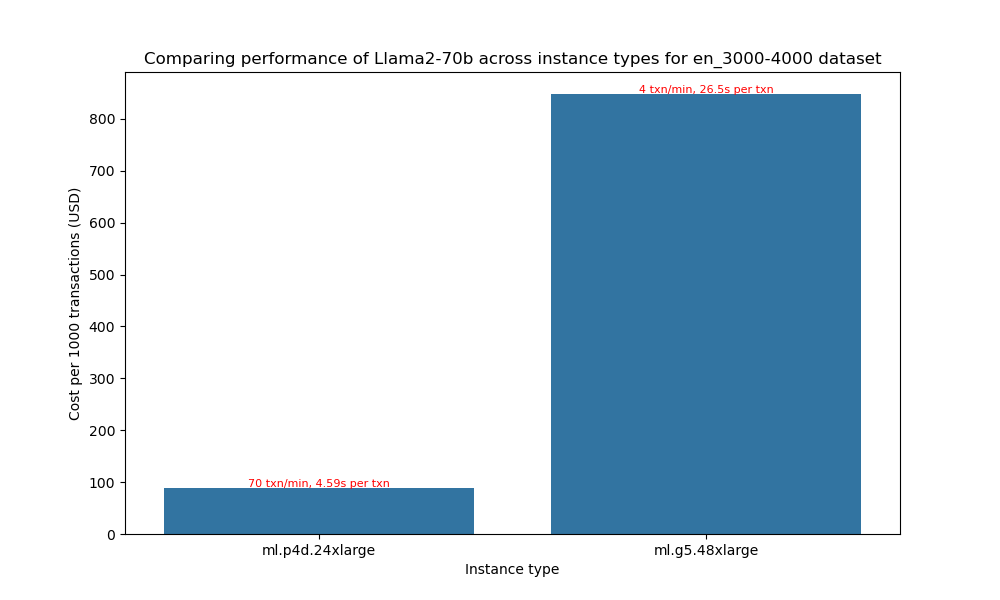
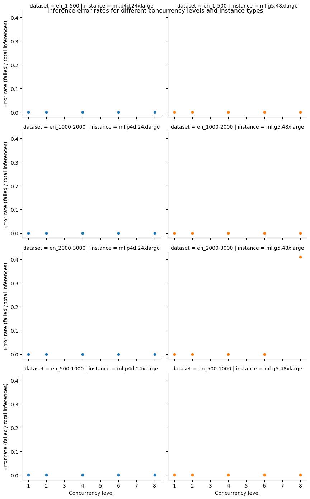
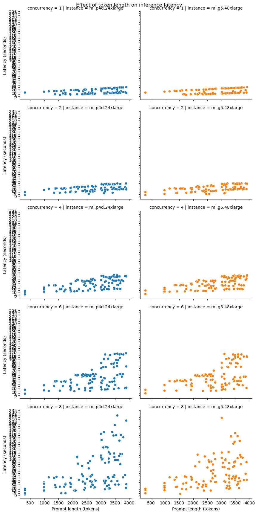
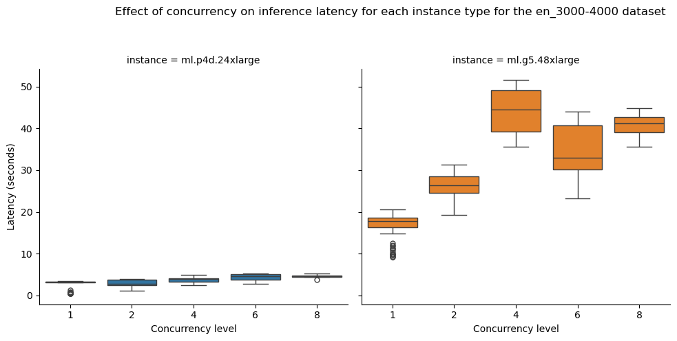

# Results for performance benchmarking

**Last modified (UTC): 2024-01-22 05:12:23.103283**

## Summary

We did performance benchmarking for the `Llama2-70b` model on "`ml.p4d.24xlarge`, `ml.g5.48xlarge`" instances on multiple datasets and based on the test results the best price performance for dataset `en_3000-4000` is provided by the `ml.g5.48xlarge` instance type.  
| Information | Value |
|-----|-----|
| experiment_name | llama2-70b-g5.48xlarge-huggingface-pytorch-tgi-inference-2.0.1-tgi1.1.0 |
| payload_file | payload_en_3000-4000.jsonl |
| instance_type | ml.g5.48xlarge |
| concurrency | 4 |
| error_rate | 0.08 |
| prompt_token_count_mean | 3950 |
| prompt_token_throughput | 295 |
| completion_token_count_mean | 102 |
| completion_token_throughput | 7 |
| latency_mean | 40.31 |
| transactions_per_minute | 4 |
| price_per_hour | 20.36 |
| price_per_txn | 0.0848 |

The price performance comparison for different instance types is presented below:

The configuration used for these tests is available in the [`config`](config-llama2-70b-g5-p4d.yml) file.

## Per instance results

The following table provides the best combinations for running inference for different sizes prompts on different instance types.
|Dataset   | Instance type   | Recommendation   |
|---|---|---|
|`payload_en_1-500.jsonl`|`ml.p4d.24xlarge`|The best option for staying within a latency budget of `20 seconds` on a `ml.p4d.24xlarge` for the `payload_en_1-500.jsonl` dataset is a `concurrency level of 8`. A concurrency level of 8 achieves an `average latency of 9.01 seconds`, for an `average prompt size of 304 tokens` and `completion size of 79 tokens` with `25 transactions/minute`.|
|`payload_en_1000-2000.jsonl`|`ml.p4d.24xlarge`|The best option for staying within a latency budget of `20 seconds` on a `ml.p4d.24xlarge` for the `payload_en_1000-2000.jsonl` dataset is a `concurrency level of 2`. A concurrency level of 2 achieves an `average latency of 18.2 seconds`, for an `average prompt size of 1643 tokens` and `completion size of 135 tokens` with `5 transactions/minute`.|
|`payload_en_2000-3000.jsonl`|`ml.p4d.24xlarge`|The best option for staying within a latency budget of `20 seconds` on a `ml.p4d.24xlarge` for the `payload_en_2000-3000.jsonl` dataset is a `concurrency level of 2`. A concurrency level of 2 achieves an `average latency of 19.27 seconds`, for an `average prompt size of 2503 tokens` and `completion size of 87 tokens` with `5 transactions/minute`.|
|`payload_en_3000-4000.jsonl`|`ml.p4d.24xlarge`|This experiment did not find any combination of concurrency level and other configuration settings that could provide a response within a latency budget of `20 seconds` on a `ml.p4d.24xlarge` for the `payload_en_3000-4000.jsonl` dataset.|
|`payload_en_500-1000.jsonl`|`ml.p4d.24xlarge`|The best option for staying within a latency budget of `20 seconds` on a `ml.p4d.24xlarge` for the `payload_en_500-1000.jsonl` dataset is a `concurrency level of 4`. A concurrency level of 4 achieves an `average latency of 16.71 seconds`, for an `average prompt size of 980 tokens` and `completion size of 90 tokens` with `10 transactions/minute`.|
|`payload_en_1-500.jsonl`|`ml.g5.48xlarge`|The best option for staying within a latency budget of `20 seconds` on a `ml.g5.48xlarge` for the `payload_en_1-500.jsonl` dataset is a `concurrency level of 8`. A concurrency level of 8 achieves an `average latency of 12.3 seconds`, for an `average prompt size of 304 tokens` and `completion size of 123 tokens` with `24 transactions/minute`.|
|`payload_en_1000-2000.jsonl`|`ml.g5.48xlarge`|The best option for staying within a latency budget of `20 seconds` on a `ml.g5.48xlarge` for the `payload_en_1000-2000.jsonl` dataset is a `concurrency level of 2`. A concurrency level of 2 achieves an `average latency of 16.97 seconds`, for an `average prompt size of 1643 tokens` and `completion size of 119 tokens` with `6 transactions/minute`.|
|`payload_en_2000-3000.jsonl`|`ml.g5.48xlarge`|The best option for staying within a latency budget of `20 seconds` on a `ml.g5.48xlarge` for the `payload_en_2000-3000.jsonl` dataset is a `concurrency level of 2`. A concurrency level of 2 achieves an `average latency of 19.47 seconds`, for an `average prompt size of 2503 tokens` and `completion size of 91 tokens` with `5 transactions/minute`.|
|`payload_en_3000-4000.jsonl`|`ml.g5.48xlarge`|This experiment did not find any combination of concurrency level and other configuration settings that could provide a response within a latency budget of `20 seconds` on a `ml.g5.48xlarge` for the `payload_en_3000-4000.jsonl` dataset.|
|`payload_en_500-1000.jsonl`|`ml.g5.48xlarge`|The best option for staying within a latency budget of `20 seconds` on a `ml.g5.48xlarge` for the `payload_en_500-1000.jsonl` dataset is a `concurrency level of 4`. A concurrency level of 4 achieves an `average latency of 15.68 seconds`, for an `average prompt size of 980 tokens` and `completion size of 90 tokens` with `10 transactions/minute`.|

## Plots

The following plots provide insights into the results from the different experiments run.

