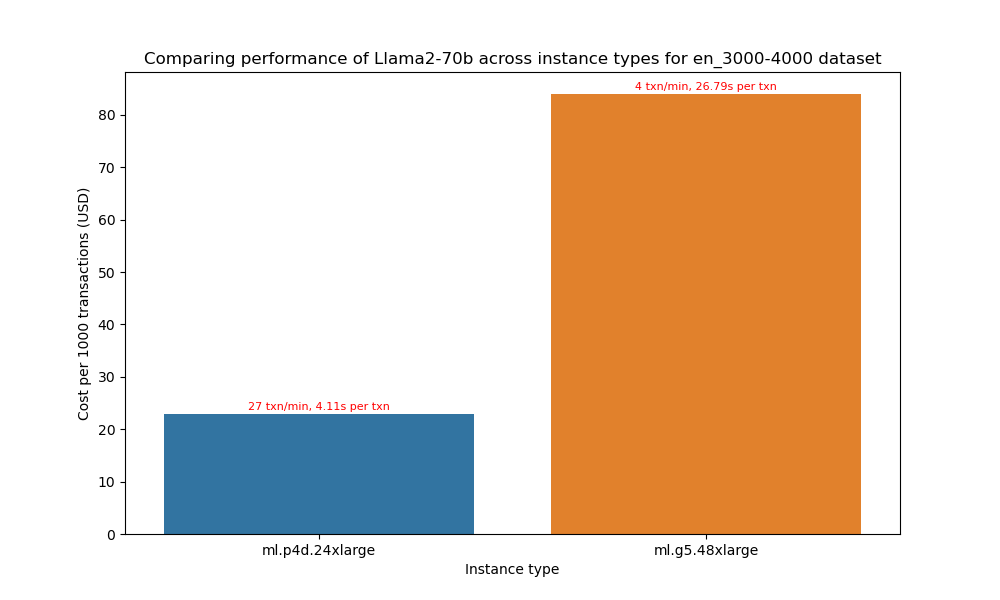
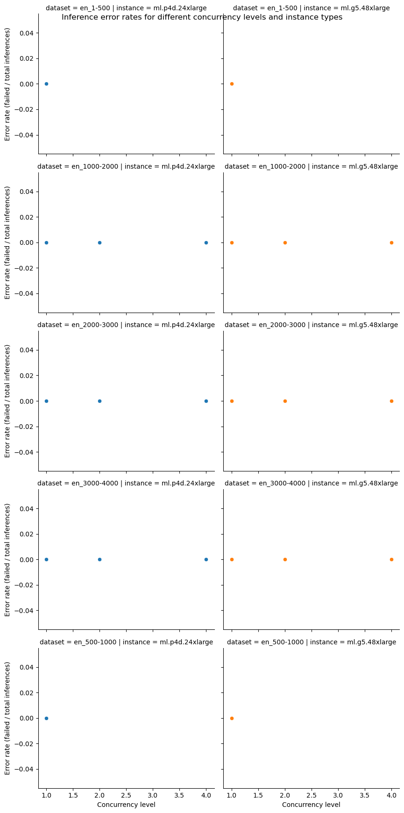
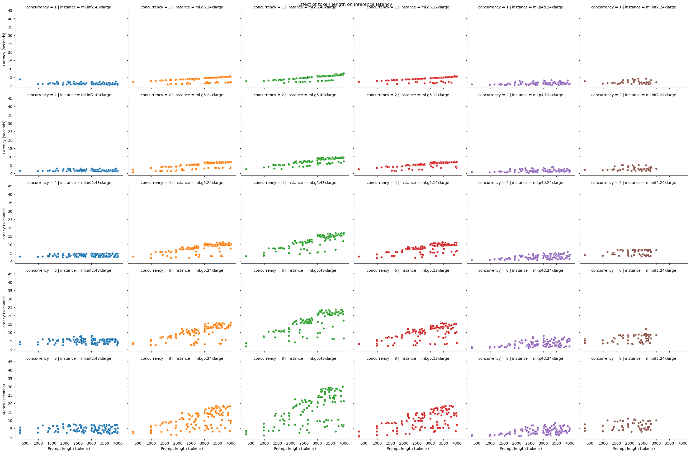
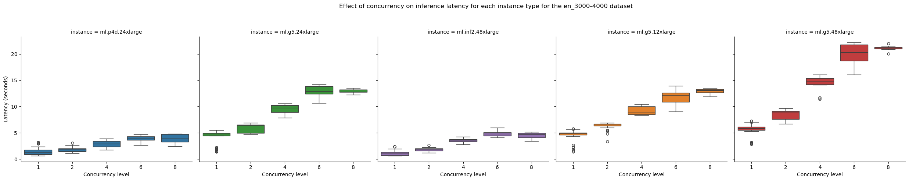

# Results for performance benchmarking

**Last modified (UTC): 2024-01-21 23:29:53.909731**

## Summary

We did performance benchmarking for the `Llama2-70b` model on "`ml.g5.48xlarge`, `ml.p4d.24xlarge`" instances on multiple datasets and based on the test results the best price performance for dataset `en_3000-4000` is provided by the `ml.p4d.24xlarge` instance type.  
| Information | Value |
|-----|-----|
| experiment_name | llama2-70b-p4d.24xlarge-tgi-inference-2.0.1-tgi0.9.3-gpu-py39-cu118 |
| payload_file | payload_en_3000-4000.jsonl |
| instance_type | ml.p4d.24xlarge |
| concurrency | 2 |
| error_rate | 0.0 |
| prompt_token_count_mean | 3474 |
| prompt_token_throughput | 1605 |
| completion_token_count_mean | 3502 |
| completion_token_throughput | 1616 |
| latency_mean | 4.11 |
| transactions_per_minute | 27 |
| price_per_hour | 37.688 |
| price_per_txn | 0.0233 |

The price performance comparison for different instance types is presented below:

The configuration used for these tests is available in the [`config`](config-llama2-70b-g5-p4d.yml) file.

## Per instance results

The following table provides the best combinations for running inference for different sizes prompts on different instance types.
|Dataset   | Instance type   | Recommendation   |
|---|---|---|
|`payload_en_1-500.jsonl`|`ml.g5.48xlarge`|The best option for staying within a latency budget of `20 seconds` on a `ml.g5.48xlarge` for the `payload_en_1-500.jsonl` dataset is a `concurrency level of 8`. A concurrency level of 8 achieves an `average latency of 15.93 seconds`, for an `average prompt size of 304 tokens` and `completion size of 102 tokens` with `18 transactions/minute`.|
|`payload_en_1000-2000.jsonl`|`ml.g5.48xlarge`|The best option for staying within a latency budget of `20 seconds` on a `ml.g5.48xlarge` for the `payload_en_1000-2000.jsonl` dataset is a `concurrency level of 2`. A concurrency level of 2 achieves an `average latency of 15.17 seconds`, for an `average prompt size of 1643 tokens` and `completion size of 79 tokens` with `6 transactions/minute`.|
|`payload_en_2000-3000.jsonl`|`ml.g5.48xlarge`|The best option for staying within a latency budget of `20 seconds` on a `ml.g5.48xlarge` for the `payload_en_2000-3000.jsonl` dataset is a `concurrency level of 2`. A concurrency level of 2 achieves an `average latency of 19.43 seconds`, for an `average prompt size of 2503 tokens` and `completion size of 68 tokens` with `5 transactions/minute`.|
|`payload_en_3000-4000.jsonl`|`ml.g5.48xlarge`|The best option for staying within a latency budget of `20 seconds` on a `ml.g5.48xlarge` for the `payload_en_3000-4000.jsonl` dataset is a `concurrency level of 1`. A concurrency level of 1 achieves an `average latency of 15.54 seconds`, for an `average prompt size of 3478 tokens` and `completion size of 70 tokens` with `3 transactions/minute`.|
|`payload_en_500-1000.jsonl`|`ml.g5.48xlarge`|The best option for staying within a latency budget of `20 seconds` on a `ml.g5.48xlarge` for the `payload_en_500-1000.jsonl` dataset is a `concurrency level of 4`. A concurrency level of 4 achieves an `average latency of 15.21 seconds`, for an `average prompt size of 980 tokens` and `completion size of 57 tokens` with `13 transactions/minute`.|
|`payload_en_1-500.jsonl`|`ml.p4d.24xlarge`|The best option for staying within a latency budget of `20 seconds` on a `ml.p4d.24xlarge` for the `payload_en_1-500.jsonl` dataset is a `concurrency level of 8`. A concurrency level of 8 achieves an `average latency of 1.96 seconds`, for an `average prompt size of 304 tokens` and `completion size of 328 tokens` with `130 transactions/minute`.|
|`payload_en_1000-2000.jsonl`|`ml.p4d.24xlarge`|The best option for staying within a latency budget of `20 seconds` on a `ml.p4d.24xlarge` for the `payload_en_1000-2000.jsonl` dataset is a `concurrency level of 8`. A concurrency level of 8 achieves an `average latency of 5.06 seconds`, for an `average prompt size of 1630 tokens` and `completion size of 1659 tokens` with `52 transactions/minute`.|
|`payload_en_2000-3000.jsonl`|`ml.p4d.24xlarge`|The best option for staying within a latency budget of `20 seconds` on a `ml.p4d.24xlarge` for the `payload_en_2000-3000.jsonl` dataset is a `concurrency level of 8`. A concurrency level of 8 achieves an `average latency of 7.54 seconds`, for an `average prompt size of 2503 tokens` and `completion size of 2531 tokens` with `34 transactions/minute`.|
|`payload_en_3000-4000.jsonl`|`ml.p4d.24xlarge`|The best option for staying within a latency budget of `20 seconds` on a `ml.p4d.24xlarge` for the `payload_en_3000-4000.jsonl` dataset is a `concurrency level of 8`. A concurrency level of 8 achieves an `average latency of 9.91 seconds`, for an `average prompt size of 3455 tokens` and `completion size of 3485 tokens` with `27 transactions/minute`.|
|`payload_en_500-1000.jsonl`|`ml.p4d.24xlarge`|The best option for staying within a latency budget of `20 seconds` on a `ml.p4d.24xlarge` for the `payload_en_500-1000.jsonl` dataset is a `concurrency level of 8`. A concurrency level of 8 achieves an `average latency of 3.07 seconds`, for an `average prompt size of 980 tokens` and `completion size of 1004 tokens` with `93 transactions/minute`.|

## Plots

The following plots provide insights into the results from the different experiments run.

