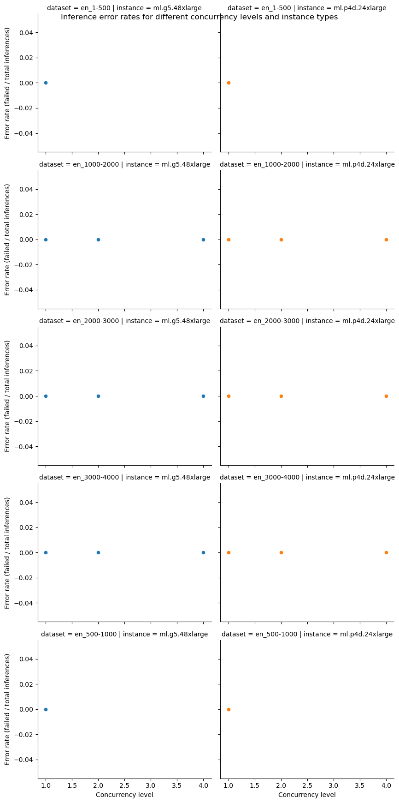
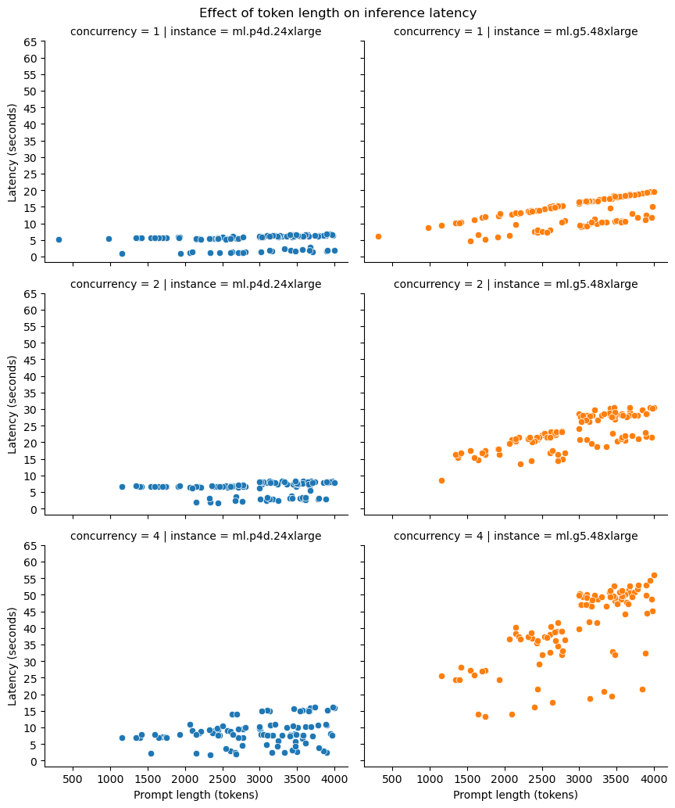

# Results for performance benchmarking

**Last modified (UTC): 2024-01-18 21:31:59.579315**

## Summary

The following table provides the best combinations for running inference for different sizes prompts on different instance types.
|Dataset   | Instance type   | Recommendation   |
|---|---|---|
|`payload_en_1-500.jsonl`|`ml.g5.48xlarge`|The best option for staying within a latency budget of `20 seconds` on a `ml.g5.48xlarge` for the `payload_en_1-500.jsonl` dataset is a `concurrency level of 1`. A concurrency level of 1 achieves an `average latency of 6.19 seconds`, for an `average prompt size of 304 tokens` and `completion size of 102 tokens` with `9 transactions/minute`.|
|`payload_en_1000-2000.jsonl`|`ml.g5.48xlarge`|The best option for staying within a latency budget of `20 seconds` on a `ml.g5.48xlarge` for the `payload_en_1000-2000.jsonl` dataset is a `concurrency level of 2`. A concurrency level of 2 achieves an `average latency of 16.0 seconds`, for an `average prompt size of 1600 tokens` and `completion size of 95 tokens` with `6 transactions/minute`.|
|`payload_en_2000-3000.jsonl`|`ml.g5.48xlarge`|The best option for staying within a latency budget of `20 seconds` on a `ml.g5.48xlarge` for the `payload_en_2000-3000.jsonl` dataset is a `concurrency level of 1`. A concurrency level of 1 achieves an `average latency of 12.47 seconds`, for an `average prompt size of 2503 tokens` and `completion size of 75 tokens` with `4 transactions/minute`.|
|`payload_en_3000-4000.jsonl`|`ml.g5.48xlarge`|The best option for staying within a latency budget of `20 seconds` on a `ml.g5.48xlarge` for the `payload_en_3000-4000.jsonl` dataset is a `concurrency level of 1`. A concurrency level of 1 achieves an `average latency of 15.16 seconds`, for an `average prompt size of 3478 tokens` and `completion size of 66 tokens` with `3 transactions/minute`.|
|`payload_en_500-1000.jsonl`|`ml.g5.48xlarge`|The best option for staying within a latency budget of `20 seconds` on a `ml.g5.48xlarge` for the `payload_en_500-1000.jsonl` dataset is a `concurrency level of 1`. A concurrency level of 1 achieves an `average latency of 8.7 seconds`, for an `average prompt size of 980 tokens` and `completion size of 102 tokens` with `6 transactions/minute`.|
|`payload_en_1-500.jsonl`|`ml.p4d.24xlarge`|The best option for staying within a latency budget of `20 seconds` on a `ml.p4d.24xlarge` for the `payload_en_1-500.jsonl` dataset is a `concurrency level of 1`. A concurrency level of 1 achieves an `average latency of 5.29 seconds`, for an `average prompt size of 304 tokens` and `completion size of 404 tokens` with `11 transactions/minute`.|
|`payload_en_1000-2000.jsonl`|`ml.p4d.24xlarge`|The best option for staying within a latency budget of `20 seconds` on a `ml.p4d.24xlarge` for the `payload_en_1000-2000.jsonl` dataset is a `concurrency level of 4`. A concurrency level of 4 achieves an `average latency of 6.81 seconds`, for an `average prompt size of 1548 tokens` and `completion size of 1641 tokens` with `30 transactions/minute`.|
|`payload_en_2000-3000.jsonl`|`ml.p4d.24xlarge`|The best option for staying within a latency budget of `20 seconds` on a `ml.p4d.24xlarge` for the `payload_en_2000-3000.jsonl` dataset is a `concurrency level of 4`. A concurrency level of 4 achieves an `average latency of 7.84 seconds`, for an `average prompt size of 2503 tokens` and `completion size of 2577 tokens` with `22 transactions/minute`.|
|`payload_en_3000-4000.jsonl`|`ml.p4d.24xlarge`|The best option for staying within a latency budget of `20 seconds` on a `ml.p4d.24xlarge` for the `payload_en_3000-4000.jsonl` dataset is a `concurrency level of 4`. A concurrency level of 4 achieves an `average latency of 9.27 seconds`, for an `average prompt size of 3482 tokens` and `completion size of 3553 tokens` with `17 transactions/minute`.|
|`payload_en_500-1000.jsonl`|`ml.p4d.24xlarge`|The best option for staying within a latency budget of `20 seconds` on a `ml.p4d.24xlarge` for the `payload_en_500-1000.jsonl` dataset is a `concurrency level of 1`. A concurrency level of 1 achieves an `average latency of 5.51 seconds`, for an `average prompt size of 980 tokens` and `completion size of 1079 tokens` with `10 transactions/minute`.|

## Plots

The following plots provide insights into the results from the different experiments run.

