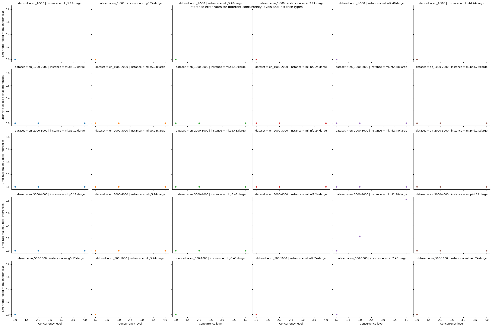
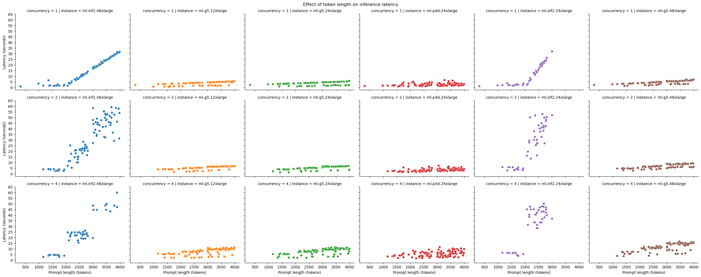

# Results for performance benchmarking

**Last modified (UTC): 2024-01-18 12:24:58.159455**

## Summary

The following table provides the best combinations for running inference for different sizes prompts on different instance types.
|Dataset   | Instance type   | Recommendation   |
|---|---|---|
|`payload_en_1-500.jsonl`|`ml.g5.12xlarge`|The best option for staying within a latency budget of `20 seconds` on a `ml.g5.12xlarge` for the `payload_en_1-500.jsonl` dataset is a `concurrency level of 1`. A concurrency level of 1 achieves an `average latency of 2.28 seconds`, for an `average prompt size of 304 tokens` and `completion size of 102 tokens` with `26 transactions/minute`.|
|`payload_en_1000-2000.jsonl`|`ml.g5.12xlarge`|The best option for staying within a latency budget of `20 seconds` on a `ml.g5.12xlarge` for the `payload_en_1000-2000.jsonl` dataset is a `concurrency level of 4`. A concurrency level of 4 achieves an `average latency of 4.76 seconds`, for an `average prompt size of 1548 tokens` and `completion size of 79 tokens` with `40 transactions/minute`.|
|`payload_en_2000-3000.jsonl`|`ml.g5.12xlarge`|The best option for staying within a latency budget of `20 seconds` on a `ml.g5.12xlarge` for the `payload_en_2000-3000.jsonl` dataset is a `concurrency level of 4`. A concurrency level of 4 achieves an `average latency of 6.67 seconds`, for an `average prompt size of 2503 tokens` and `completion size of 78 tokens` with `28 transactions/minute`.|
|`payload_en_3000-4000.jsonl`|`ml.g5.12xlarge`|The best option for staying within a latency budget of `20 seconds` on a `ml.g5.12xlarge` for the `payload_en_3000-4000.jsonl` dataset is a `concurrency level of 4`. A concurrency level of 4 achieves an `average latency of 9.08 seconds`, for an `average prompt size of 3482 tokens` and `completion size of 84 tokens` with `22 transactions/minute`.|
|`payload_en_500-1000.jsonl`|`ml.g5.12xlarge`|The best option for staying within a latency budget of `20 seconds` on a `ml.g5.12xlarge` for the `payload_en_500-1000.jsonl` dataset is a `concurrency level of 1`. A concurrency level of 1 achieves an `average latency of 0.62 seconds`, for an `average prompt size of 980 tokens` and `completion size of 10 tokens` with `96 transactions/minute`.|
|`payload_en_1-500.jsonl`|`ml.g5.24xlarge`|The best option for staying within a latency budget of `20 seconds` on a `ml.g5.24xlarge` for the `payload_en_1-500.jsonl` dataset is a `concurrency level of 1`. A concurrency level of 1 achieves an `average latency of 2.29 seconds`, for an `average prompt size of 304 tokens` and `completion size of 102 tokens` with `26 transactions/minute`.|
|`payload_en_1000-2000.jsonl`|`ml.g5.24xlarge`|The best option for staying within a latency budget of `20 seconds` on a `ml.g5.24xlarge` for the `payload_en_1000-2000.jsonl` dataset is a `concurrency level of 4`. A concurrency level of 4 achieves an `average latency of 4.58 seconds`, for an `average prompt size of 1548 tokens` and `completion size of 74 tokens` with `41 transactions/minute`.|
|`payload_en_2000-3000.jsonl`|`ml.g5.24xlarge`|The best option for staying within a latency budget of `20 seconds` on a `ml.g5.24xlarge` for the `payload_en_2000-3000.jsonl` dataset is a `concurrency level of 4`. A concurrency level of 4 achieves an `average latency of 7.01 seconds`, for an `average prompt size of 2503 tokens` and `completion size of 84 tokens` with `28 transactions/minute`.|
|`payload_en_3000-4000.jsonl`|`ml.g5.24xlarge`|The best option for staying within a latency budget of `20 seconds` on a `ml.g5.24xlarge` for the `payload_en_3000-4000.jsonl` dataset is a `concurrency level of 4`. A concurrency level of 4 achieves an `average latency of 9.16 seconds`, for an `average prompt size of 3482 tokens` and `completion size of 85 tokens` with `21 transactions/minute`.|
|`payload_en_500-1000.jsonl`|`ml.g5.24xlarge`|The best option for staying within a latency budget of `20 seconds` on a `ml.g5.24xlarge` for the `payload_en_500-1000.jsonl` dataset is a `concurrency level of 1`. A concurrency level of 1 achieves an `average latency of 2.8 seconds`, for an `average prompt size of 980 tokens` and `completion size of 102 tokens` with `21 transactions/minute`.|
|`payload_en_1-500.jsonl`|`ml.g5.48xlarge`|The best option for staying within a latency budget of `20 seconds` on a `ml.g5.48xlarge` for the `payload_en_1-500.jsonl` dataset is a `concurrency level of 1`. A concurrency level of 1 achieves an `average latency of 2.32 seconds`, for an `average prompt size of 304 tokens` and `completion size of 102 tokens` with `25 transactions/minute`.|
|`payload_en_1000-2000.jsonl`|`ml.g5.48xlarge`|The best option for staying within a latency budget of `20 seconds` on a `ml.g5.48xlarge` for the `payload_en_1000-2000.jsonl` dataset is a `concurrency level of 4`. A concurrency level of 4 achieves an `average latency of 6.34 seconds`, for an `average prompt size of 1548 tokens` and `completion size of 64 tokens` with `31 transactions/minute`.|
|`payload_en_2000-3000.jsonl`|`ml.g5.48xlarge`|The best option for staying within a latency budget of `20 seconds` on a `ml.g5.48xlarge` for the `payload_en_2000-3000.jsonl` dataset is a `concurrency level of 4`. A concurrency level of 4 achieves an `average latency of 10.54 seconds`, for an `average prompt size of 2503 tokens` and `completion size of 89 tokens` with `19 transactions/minute`.|
|`payload_en_3000-4000.jsonl`|`ml.g5.48xlarge`|The best option for staying within a latency budget of `20 seconds` on a `ml.g5.48xlarge` for the `payload_en_3000-4000.jsonl` dataset is a `concurrency level of 4`. A concurrency level of 4 achieves an `average latency of 13.49 seconds`, for an `average prompt size of 3482 tokens` and `completion size of 79 tokens` with `15 transactions/minute`.|
|`payload_en_500-1000.jsonl`|`ml.g5.48xlarge`|The best option for staying within a latency budget of `20 seconds` on a `ml.g5.48xlarge` for the `payload_en_500-1000.jsonl` dataset is a `concurrency level of 1`. A concurrency level of 1 achieves an `average latency of 2.76 seconds`, for an `average prompt size of 980 tokens` and `completion size of 102 tokens` with `21 transactions/minute`.|
|`payload_en_1-500.jsonl`|`ml.inf2.24xlarge`|The best option for staying within a latency budget of `20 seconds` on a `ml.inf2.24xlarge` for the `payload_en_1-500.jsonl` dataset is a `concurrency level of 1`. A concurrency level of 1 achieves an `average latency of 1.0 seconds`, for an `average prompt size of 304 tokens` and `completion size of 25 tokens` with `60 transactions/minute`.|
|`payload_en_1000-2000.jsonl`|`ml.inf2.24xlarge`|The best option for staying within a latency budget of `20 seconds` on a `ml.inf2.24xlarge` for the `payload_en_1000-2000.jsonl` dataset is a `concurrency level of 4`. A concurrency level of 4 achieves an `average latency of 5.82 seconds`, for an `average prompt size of 1548 tokens` and `completion size of 78 tokens` with `36 transactions/minute`.|
|`payload_en_2000-3000.jsonl`|`ml.inf2.24xlarge`|The best option for staying within a latency budget of `20 seconds` on a `ml.inf2.24xlarge` for the `payload_en_2000-3000.jsonl` dataset is a `concurrency level of 1`. A concurrency level of 1 achieves an `average latency of 16.44 seconds`, for an `average prompt size of 2503 tokens` and `completion size of 39 tokens` with `5 transactions/minute`.|
|`payload_en_500-1000.jsonl`|`ml.inf2.24xlarge`|The best option for staying within a latency budget of `20 seconds` on a `ml.inf2.24xlarge` for the `payload_en_500-1000.jsonl` dataset is a `concurrency level of 1`. A concurrency level of 1 achieves an `average latency of 1.87 seconds`, for an `average prompt size of 980 tokens` and `completion size of 17 tokens` with `31 transactions/minute`.|
|`payload_en_1-500.jsonl`|`ml.inf2.48xlarge`|The best option for staying within a latency budget of `20 seconds` on a `ml.inf2.48xlarge` for the `payload_en_1-500.jsonl` dataset is a `concurrency level of 1`. A concurrency level of 1 achieves an `average latency of 0.81 seconds`, for an `average prompt size of 304 tokens` and `completion size of 27 tokens` with `73 transactions/minute`.|
|`payload_en_1000-2000.jsonl`|`ml.inf2.48xlarge`|The best option for staying within a latency budget of `20 seconds` on a `ml.inf2.48xlarge` for the `payload_en_1000-2000.jsonl` dataset is a `concurrency level of 4`. A concurrency level of 4 achieves an `average latency of 4.23 seconds`, for an `average prompt size of 1548 tokens` and `completion size of 79 tokens` with `51 transactions/minute`.|
|`payload_en_2000-3000.jsonl`|`ml.inf2.48xlarge`|The best option for staying within a latency budget of `20 seconds` on a `ml.inf2.48xlarge` for the `payload_en_2000-3000.jsonl` dataset is a `concurrency level of 2`. A concurrency level of 2 achieves an `average latency of 18.7 seconds`, for an `average prompt size of 2503 tokens` and `completion size of 61 tokens` with `6 transactions/minute`.|
|`payload_en_3000-4000.jsonl`|`ml.inf2.48xlarge`|This experiment did not find any combination of concurrency level and other configuration settings that could provide a response within a latency budget of `20 seconds` on a `ml.inf2.48xlarge` for the `payload_en_3000-4000.jsonl` dataset.|
|`payload_en_500-1000.jsonl`|`ml.inf2.48xlarge`|The best option for staying within a latency budget of `20 seconds` on a `ml.inf2.48xlarge` for the `payload_en_500-1000.jsonl` dataset is a `concurrency level of 1`. A concurrency level of 1 achieves an `average latency of 3.55 seconds`, for an `average prompt size of 980 tokens` and `completion size of 17 tokens` with `16 transactions/minute`.|
|`payload_en_1-500.jsonl`|`ml.p4d.24xlarge`|The best option for staying within a latency budget of `20 seconds` on a `ml.p4d.24xlarge` for the `payload_en_1-500.jsonl` dataset is a `concurrency level of 1`. A concurrency level of 1 achieves an `average latency of 1.37 seconds`, for an `average prompt size of 304 tokens` and `completion size of 328 tokens` with `37 transactions/minute`.|
|`payload_en_1000-2000.jsonl`|`ml.p4d.24xlarge`|The best option for staying within a latency budget of `20 seconds` on a `ml.p4d.24xlarge` for the `payload_en_1000-2000.jsonl` dataset is a `concurrency level of 4`. A concurrency level of 4 achieves an `average latency of 3.96 seconds`, for an `average prompt size of 1548 tokens` and `completion size of 1581 tokens` with `44 transactions/minute`.|
|`payload_en_2000-3000.jsonl`|`ml.p4d.24xlarge`|The best option for staying within a latency budget of `20 seconds` on a `ml.p4d.24xlarge` for the `payload_en_2000-3000.jsonl` dataset is a `concurrency level of 4`. A concurrency level of 4 achieves an `average latency of 5.08 seconds`, for an `average prompt size of 2503 tokens` and `completion size of 2534 tokens` with `34 transactions/minute`.|
|`payload_en_3000-4000.jsonl`|`ml.p4d.24xlarge`|The best option for staying within a latency budget of `20 seconds` on a `ml.p4d.24xlarge` for the `payload_en_3000-4000.jsonl` dataset is a `concurrency level of 4`. A concurrency level of 4 achieves an `average latency of 6.21 seconds`, for an `average prompt size of 3482 tokens` and `completion size of 3510 tokens` with `28 transactions/minute`.|
|`payload_en_500-1000.jsonl`|`ml.p4d.24xlarge`|The best option for staying within a latency budget of `20 seconds` on a `ml.p4d.24xlarge` for the `payload_en_500-1000.jsonl` dataset is a `concurrency level of 1`. A concurrency level of 1 achieves an `average latency of 1.66 seconds`, for an `average prompt size of 980 tokens` and `completion size of 1004 tokens` with `36 transactions/minute`.|

## Plots

The following plots provide insights into the results from the different experiments run.

