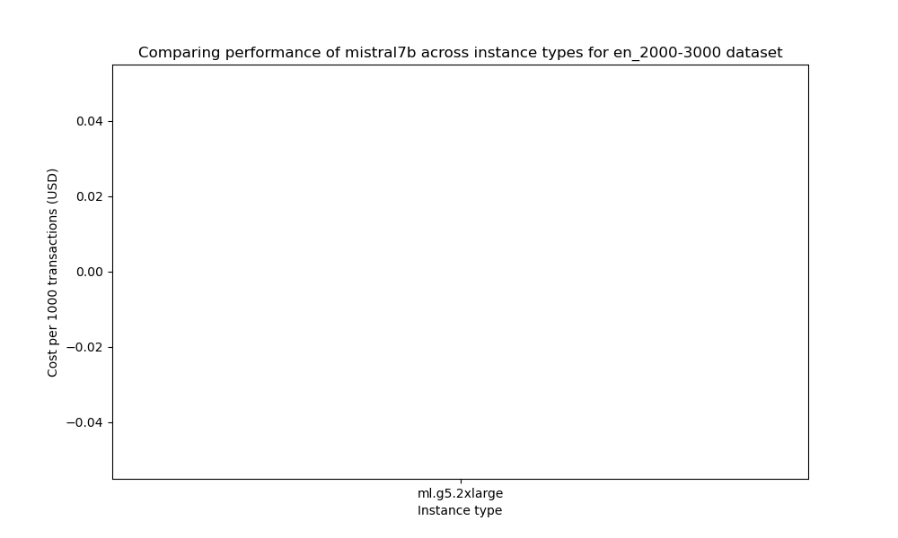
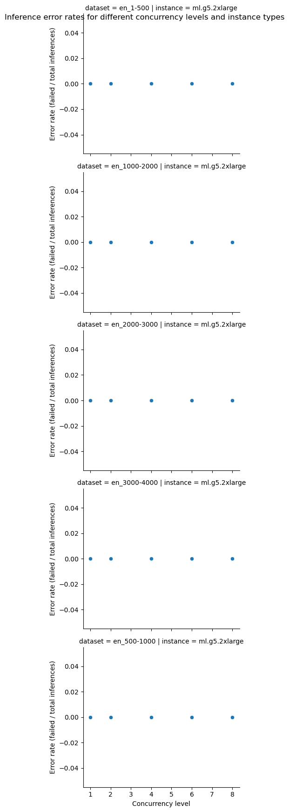
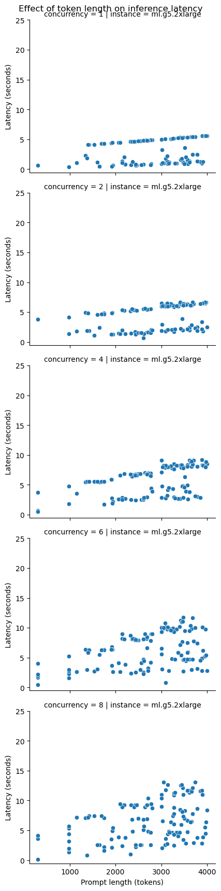

# Results for performance benchmarking

**Last modified (UTC): 2024-01-23 22:40:56.739490**

## Summary

We did performance benchmarking for the `mistral7b` model on "`ml.g5.2xlarge`" instance on multiple datasets and based on the test results the best price performance for dataset `en_3000-4000` is provided by the `ml.g5.2xlarge` instance type.  
| Information | Value |
|-----|-----|
| experiment_name | mistral-7b-g5-huggingface-pytorch-tgi-inference-2.0.1-tgi1.1.0 |
| payload_file | payload_en_3000-4000.jsonl |
| instance_type | ml.g5.2xlarge |
| concurrency | 8 |
| error_rate | 0.0 |
| prompt_token_count_mean | 3455 |
| prompt_token_throughput | 2158 |
| completion_token_count_mean | 50 |
| completion_token_throughput | 30 |
| latency_mean | 7.56 |
| transactions_per_minute | 37 |
| price_per_hour | 1.515 |
| price_per_txn | 0.0007 |

The price performance comparison for different instance types is presented below:

The configuration used for these tests is available in the [`config`](config-mistral-7b-tgi-g5.yml) file.

## Per instance results

The following table provides the best combinations for running inference for different sizes prompts on different instance types.
|Dataset   | Instance type   | Recommendation   |
|---|---|---|
|`payload_en_1-500.jsonl`|`ml.g5.2xlarge`|The best option for staying within a latency budget of `20 seconds` on a `ml.g5.2xlarge` for the `payload_en_1-500.jsonl` dataset is a `concurrency level of 8`. A concurrency level of 8 achieves an `average latency of 3.54 seconds`, for an `average prompt size of 304 tokens` and `completion size of 88 tokens` with `62 transactions/minute`.|
|`payload_en_1000-2000.jsonl`|`ml.g5.2xlarge`|The best option for staying within a latency budget of `20 seconds` on a `ml.g5.2xlarge` for the `payload_en_1000-2000.jsonl` dataset is a `concurrency level of 8`. A concurrency level of 8 achieves an `average latency of 4.8 seconds`, for an `average prompt size of 1630 tokens` and `completion size of 57 tokens` with `64 transactions/minute`.|
|`payload_en_2000-3000.jsonl`|`ml.g5.2xlarge`|The best option for staying within a latency budget of `20 seconds` on a `ml.g5.2xlarge` for the `payload_en_2000-3000.jsonl` dataset is a `concurrency level of 8`. A concurrency level of 8 achieves an `average latency of 6.46 seconds`, for an `average prompt size of 2503 tokens` and `completion size of 63 tokens` with `45 transactions/minute`.|
|`payload_en_3000-4000.jsonl`|`ml.g5.2xlarge`|The best option for staying within a latency budget of `20 seconds` on a `ml.g5.2xlarge` for the `payload_en_3000-4000.jsonl` dataset is a `concurrency level of 8`. A concurrency level of 8 achieves an `average latency of 7.56 seconds`, for an `average prompt size of 3455 tokens` and `completion size of 50 tokens` with `37 transactions/minute`.|
|`payload_en_500-1000.jsonl`|`ml.g5.2xlarge`|The best option for staying within a latency budget of `20 seconds` on a `ml.g5.2xlarge` for the `payload_en_500-1000.jsonl` dataset is a `concurrency level of 8`. A concurrency level of 8 achieves an `average latency of 3.7 seconds`, for an `average prompt size of 980 tokens` and `completion size of 60 tokens` with `74 transactions/minute`.|

## Plots

The following plots provide insights into the results from the different experiments run.

