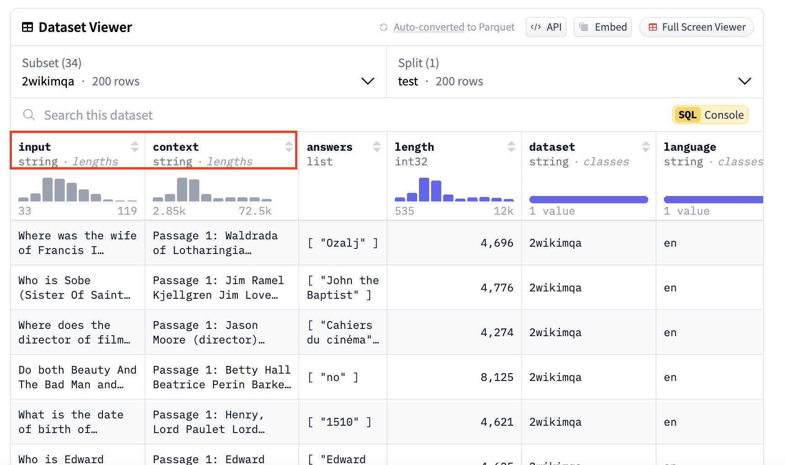
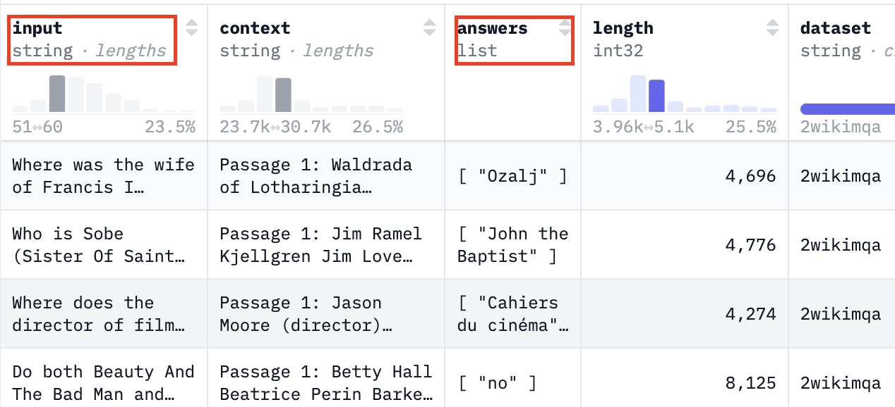
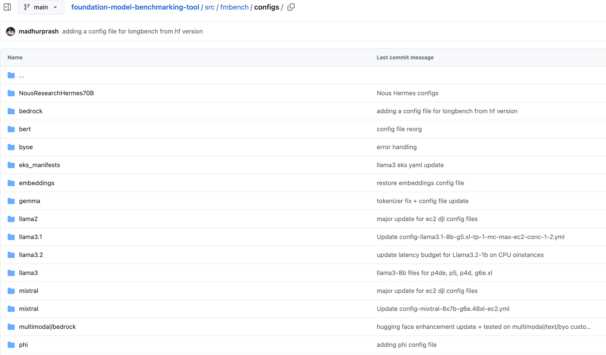

# Customize config files for specific use cases

## Overview

To run `FMBench`, you have to provide a configuration file. A configuration file is simple `yml` file that contains the information about the models to benchmark, dataset information, prompt templates, custom thresholds for latency, cost and accuracy and other important metrics. View an annotated config file [here](https://github.com/aws-samples/foundation-model-benchmarking-tool/blob/main/fmbench/configs/llama2/7b/config-llama2-7b-g5-quick.yml). A typical `FMBench` workflow involves either directly using an already provided config file from the `configs` folder provided in the `FMBench` [website](https://aws-samples.github.io/foundation-model-benchmarking-tool/manifest.html) or [Github repo](https://github.com/aws-samples/foundation-model-benchmarking-tool/tree/main/src/fmbench/configs) or editing an already provided config file as per your own requirements (for example, benchmarking on a different instance type, or a different inference container, or even with custom datasets and various models).

In this documentation, we will do a walkthrough of the different sections that you can change within the config file based on your specific use case and requirements. **We will take an example of a user who wants to create a config file for `NousResearch/Hermes-3-Llama-3.1-70B` model on a `trn1.32xlarge` EC2 instance.**

***Note: This lab is not a hands-on lab. It is a walk through of a sample configuration file that `FMBench` uses to benchmark any Foundation Model (FM) on any AWS generative AI service and description of sections that users can tweak for their own use case.***

Let's get started:

### FMBench Configuration Walkthrough

Let's take an example to walk through a sample config file. Say a user is interested in using `llama3-70b` for their `question-answering` and `doc-summarization` use cases. A couple of questions they would ask themselves before beginning the benchmarking process is: ***Which model should I use? Should it be open-source/closed-source or proprietary fine-tuned models?, What instance should I host this model on so I can get my minimum requirements for latency, cost and accuracy satisfied?, Which dataset should I use - is there an open source data that I can use as a representation of my own dataset, or can I benchmark using my custom enterprise data? How do I compute pricing? What are the ways I can evaluate my models on accuracy?*** and so on. 

The `FMBench` configuration file takes away the cognitive burden to figure out the answer to these questions and organizing them into parameters for `model id`, `instance types`, `inference containers`, datasets to use, and various other metrics that play a role in model performance and accuracy. The `FMBench` config file is broadly divided in the following:

### Model Information

To decide on which model to use, on a given instance type and container, fill out the information in the `experiments` section of the configuration file. This `experiments` section contains configuration about experiments to be run. The `experiments` section is an array so more than one experiments can be added, these could belong to the **same model but different instance types, or different models, or even different hosting options**. Each experiment represents model under test and the specific information associated to that model. View an example below.

  ```{.yaml}
  experiments:
  - name: "Hermes-3-Llama-3.1-70B"
      region: {region}
      model_id: NousResearch/Hermes-3-Llama-3.1-70B #model id, version and image uri not needed for byo endpoint
      hf_tokenizer_model_id: meta-llama/Llama-3.1-70B
      model_version:
      model_name: "Hermes-3-Llama-3.1-70B"
      ep_name: 'http://localhost:8080/v2/models/Hermes-3-Llama-3.1-70B/generate' 
      instance_type: "trn1.32xlarge"
      image_uri: tritonserver-neuronx:fmbench 
      deploy: yes #setting to yes to run deployment script for ec2
      instance_count: 
      deployment_script: ec2_deploy.py
      inference_script: ec2_predictor.py
      # This section defines the settings for Amazon EC2 instances
      ec2:
      model_loading_timeout: 10000
      inference_spec:
      parameter_set: ec2_djl
      container_type: triton
      # For deploying a model using the triton inference container: 
      # mention the backend type, if any. Options for triton are: [djl, vllm or tensorrt]
      backend: djl
      # how many copies of the model, 1, 2,..max
      # set to 1 in the code if not configured,
      # max: FMBench figures out the max number of model containers to be run
      #      based on TP degree configured and number of neuron cores/GPUs available.
      #      For example, if TP=2, GPUs=8 then FMBench will start 4 containers and 1 load balancer,
      # auto: only supported if the underlying inference container would automatically 
      #       start multiple copies of the model internally based on TP degree and neuron cores/GPUs
      #       available. In this case only a single container is created, no load balancer is created.
      #       The DJL serving containers supports auto.  
      model_copies: max
      shm_size: 12g
      # The model.json parameters are replaced within the model.json file
      # for the triton on vllm/djl/tensorrt options. The model.json already contains
      # the tp degree and model id from above in this config file. This is a dictionary
      # that contains other variables, such as max_num_seqs, dtype, max_model_len, block_size and more
      # For tensorrt, the tp degree, batch size and other relevant parameters are 
      # extracted directly from the inference spec.
      container_params:
          # tp degree is a mandatory parameter
          tp_degree: 32
          amp: "f16" # and so on
          # modify the serving properties to match your model and requirements
          serving.properties:

  ```

  Here are the list of parameters that can be changed based on your use case and models you would like to benchmark:

  - **Model Id (`model_id`)**: This is the `model id` of the model that you would like to benchmark. This can be any open source model on `HuggingFace`, a `SageMaker Jumpstart` model, a `Bedrock` model, or any Foundation Model that you would like to benchmark on **any AWS generative AI service**. For this specific example, the user was interested in benchmarking the fine-tuned version of `Llama-3.1-70B`, so they pointed the `model_id` to the HF model: `NousResearch/Hermes-3-Llama-3.1-70B`. You can change the `name` and the `model_name` parameter to any custom name that you would like to based on the `model_id` that you are using in the config file. 

  - **Tokenizer (`hf_tokenizer_model_id`)**: If your model is a Hugging Face model, and if you would like to use that model's tokenizer, then point the `hf_tokenizer_model_id` parameter to the `model_id` on hugging face and that specific model's tokenizer will be used in the benchmarking test.

  - **Instance Type (`instance_type`)**: This is the instance type/hardware on which the model is deployed and hosted. In this case, the user was interested to deploy the model on a `trn1.32xlarge` instance, so they pointed the `instance_type` parameter to `trn1.32xlarge`. You can point this parameter to any `instance_type` that you want to deploy the model on. This can either be a `GPU`/`CPU`/`AWS Silicon (i.e. inf2/trn1/trn2)` instance. View the list of models that have been benchmarked on various instances using `FMBench` [here](https://github.com/aws-samples/foundation-model-benchmarking-tool?tab=readme-ov-file#full-list-of-benchmarked-models)


  - **Inference Container (`image_uri`)**: If the user is interested in using a specific container of choice, they can point the `image_uri` parameter to that inference container. `FMBench` supports the `HF TGI`, `Triton`, `Deep Java Library`, `vLLM` and `Ollama` containers. This means that the user would not have to write any custom code to deploy the model or benchmark it using any of these containers that `FMBench` provides built in support for. In this case, the user was interested in benchmarking `NousResearch/Hermes-3-Llama-3.1-70B` on the `triton` inference server, so they pointed the `image_uri` to `tritonserver-neuronx:fmbench`. Users can bring their own containers and point to that within the configuration file (this would require the user to provide a custom deployment and inference script that supports the deployment and prediction format that the specific inference container supports if it is not already supported on `FMBench`). 


  - **Inference/Deployment Scripts (`deployment_script`, `inference_script`)**: `FMBench` comes packaged with multiple inference and deployment scripts. These scripts will deploy models on `SageMaker`, `Bedrock`, `EC2`, `EKS`, and also support inference on those models based on their respective inference scripts. If users deploy and make inferences from a model using a format that is not already supported on `FMBench`, users can **bring in custom deployment and predictor scripts**. Given above is an example for a model deployed on an Amazon `EC2` instance using the `ec2_deploy.py` deployment script and make inferences on the model using the `ec2_predictor.py inference script.` To view how you can bring your own custom deployment and inference files to `FMBench` to benchmark your custom models, view [here](https://aws-samples.github.io/foundation-model-benchmarking-tool/byo_rest_predictor.html). An example custom inference script [here](https://github.com/aws-samples/foundation-model-benchmarking-tool/blob/main/fmbench/scripts/rest_predictor.py) that is specified in [this](https://github.com/aws-samples/foundation-model-benchmarking-tool/blob/82fc6f08f168b9c1c2ff1d72a01b1004525708d6/fmbench/configs/llama2/13b/config-byo-rest-ep-llama2-13b.yml#L184) configuration file.


  - **Endpoint Name (`ep_name`)**: This parameter specifies the endpoint URL where the model will be accessible. In the example, it's set to `'http://localhost:8080/v2/models/Hermes-3-Llama-3.1-70B/generate'` since the model is hosted on an EC2 instance. For models deployed on `Bedrock`, the `ep_name` is the `Bedrock model_id` since that is what is used while running inferences against the model. If your model is deployed on `SageMaker`, then the endpoint name is dynamically created based on what you provide as the `ep_name` in the configuration file. If you already have a model deployed and want to use your own endpoint, you can:
      - Set `deploy: no` in the experiment configuration
      - Provide your existing `EC2` endpoint URL/SageMaker endpoint in the `ep_name` field
      - Skip the deployment-specific parameters as they won't be needed

      For more information on bringing your own endpoint, view the documentation on it [here](https://aws-samples.github.io/foundation-model-benchmarking-tool/byoe.html).


  - **Container Parameters (`container_params`/`serving.properties`)**: This section allows you to configure model-specific serving parameters such as:
    - `tp_degree`: Tensor parallelism degree for distributed inference
    - `amp`: Automatic mixed precision settings (e.g., "f16", "bf16")
    - `serving.properties`: Additional serving configuration parameters specific to your inference container such as `max_rolling_batch_size`, `n_positions`, etc.
    These parameters are not limited and can be changed/extended based on the parameters supported by your inference container.

### Inference Parameters

After configuring the model deployment settings, the next step is to specify how you want the model to generate responses. The inference parameters section allows you to customize the generation behavior based on your use case:
  ```yaml
  inference_parameters: 
    ec2_djl:
      top_k: 50  
      max_new_tokens: 100
  ```
  These parameters directly affect the model's output and performance characteristics. For example:

  - For a summarization use case, a user might want to set `max_new_tokens` to a higher value like `512` or `1024` to allow for comprehensive summaries of longer documents.
  - For a quick Q&A application, you might keep `max_new_tokens` lower at `100-200` to get concise responses.
  - The `top_k` parameter controls response diversity by limiting the token selection to the k most likely next tokens.

  You can add any parameter that your **inference container supports**. The parameters are organized by deployment type (ec2_djl, SageMaker, bedrock, any custom parameters that you would want to set etc.) to match the `parameter_set` specified in your experiment configuration. For example, if using Bedrock's model, you would specify `bedrock` or any custom parameter set name:

  ```yaml
  inference_parameters:
    bedrock:
      temperature: 0.7
      max_new_tokens: 512
      top_p: 0.9
  ```

  Once you have defined your inference parameters, you can point to that inference parameter spec in the experiment section as given below:

  ```yaml
  # Model configurations for llama-2 7b for deploying on g5 x and 2x large instances
experiments:
  - name: <model_name>
    model_id: # model id, version and image uri not needed for byo endpoint
    model_version:
    model_name: <your-model-name>
    ep_name: "<your-endpoint-name>"
    .
    .
    .
    inference_spec:
      parameter_set: bedrock # you can have a different inference parameter set for each experiment depending on the
                             # model inference parameters
  ``` 


#### Use custom datasets & prompts within `FMBench` 

`FMBench` now supports benchmarking models using datasets from Hugging Face with a simplified prefixing method. To specify a Hugging Face dataset and its split, use the `hf:` prefix followed by the `dataset identifier`, `subset name`, and `split name`. If a `subset name` is not provided, it defaults to `default`. If a `split name` is not provided, `FMBench` automatically selects the next available split at runtime.

  - To configure your dataset in `FMBench`, add entries to `source_data_files` in your configuration file:
    ```yaml
    source_data_files:
    # Format: hf:dataset-id/subset-name/split-name
    # If no subset name is provided, use "default".
    - hf:THUDM/LongBench/2wikimqa_e/test
    - hf:THUDM/LongBench/2wikimqa/test
    - hf:THUDM/LongBench/hotpotqa_e/test
    - hf:THUDM/LongBench/hotpotqa/test
    - hf:THUDM/LongBench/narrativeqa/test
    - hf:THUDM/LongBench/triviaqa_e/test
    - hf:THUDM/LongBench/triviaqa/test
    ```
You can follow this format for any `text` or `image-based` dataset from Hugging Face. Alternatively, you can use custom datasets in `JSONL` format.

- For domain-specific or personalized benchmarking, you can use custom datasets. These datasets can be:
  - **Synthetic/Open source datasets (available on Hugging Face)**
  - **Proprietary data (not publicly available)**

- To use custom data, convert it into JSONL format. We provide a sample notebook to help convert Hugging Face or custom datasets into JSONL and upload them to an S3 bucket used by FMBench. Follow the steps in the [bring_your_own_dataset]((https://github.com/aws-samples/foundation-model-benchmarking-tool/blob/main/src/fmbench/bring_your_own_dataset.ipynb)) notebook to integrate your own dataset into `FMBench`. Place these `JSONL` files in the `source_data` directory within `/tmp/fmbench-read/source_data` in your local instance. .

- **Use specific keys from the dataset in your prompts**: Since `FMBench` uses `LongBench` as the dataset under test by default, it requires specific keys that contain `user queries`, `context`, or other necessary fields. To specify dataset keys, add them under `prompt_template_keys` in the `datasets` section of your configuration file:

  ```yaml
  datasets:
      prompt_template_keys:
        - input
        - context
  ```

  These keys correspond to fields in the Hugging Face dataset, as shown in the example below:

  

- **Using a Custom Prompt Template**: The specified dataset keys can be used in a custom prompt template for generating input payloads. Below is an example of a prompt template utilizing these keys:

  ```
  <think>
    There can be multiple question answer pairs in the context.
    As soon as you find the first question in the text below immediately stop reading any further and just answer the question.
    Always start your response with "<think>" at the beginning of every output and think step by step.
    Keep your thinking process short and your answers concise, do not overthink.
    Make sure to always provide an answer, if you do not know the answer then say I do not known but never leave the answer field empty in your response.
    </think>

    <answer>
    Put your final answer in one line starting with the word Answer:
    </answer>

    Here is the text for you to work on:

    <text>
    {input}

    {context}
    </text>
  ```

- **Adding the Prompt Template to FMBench**: To use the custom prompt template, place it in the `/tmp/fmbench-read/prompt_templates` directory. `FMBench` will download and apply it during benchmarking.

  ``` yaml
  # prompt template to use, NOTE: same prompt template gets used for all models being tested through a config file
  # the FMBench repo already contains a bunch of prompt templates so review those first before creating a new one
  prompt_template_file: prompt_template_llama3.txt
  ```
  By following these steps, you can seamlessly integrate Hugging Face datasets or custom data into FMBench, enabling tailored benchmarking for your use case.

**Filtering Options**: If your dataset contains multiple languages and includes a language field, you can filter it to retain only prompts in a specific language. Additionally, you can filter prompts based on token length, which is determined using the tokenizer specified in the tokenizer_prefix in the S3 bucket. The example below filters for English prompts with a token length between `1,000` and `2,000`, saving the results in a designated payload file that `FMBench` then uses in the benchmarking test. You can filter this based on your custom token length filtering preferences.

  ```yaml
  datasets:
    filters:
      - language: en    
        min_length_in_tokens: 1000
        max_length_in_tokens: 2000
        payload_file: payload_en_1000-2000.jsonl
  ```

**Metrics Configuration**: Specify `dataset_of_interest` for focused performance analysis. While the tests would run on all the datasets configured in the experiment entries below but the price|performance analysis is only done for 1 dataset which is listed below as the dataset_of_interest. If a user is interested in seeing model benchmarks for prompt sizes `1000-2000` tokens, then set the `dataset_of_interest` to `en_1000-2000`. If it is a `summarization use case` and your dataset is large enough, you can add a filter to use `payload_en_3000-3840.jsonl` and set the `dataset_of_interest` to `en_3000-3840` tokens. This can be any custom value.

  ```yaml
  datasets:
    .
    .
    .
    metrics:
      dataset_of_interest: en_1000-2000
  ```

#### Bring your own Endpoint (BYOE Configuration)

- You can customize FMBench to use the BYOE mode when you want to bring an already deployed model either on AWS or your custom infrastructure.

- Point the `ep_name` parameter in your configuration file to the `endpoint URL` so that `FMBench` can use it while making predictions. View [`here`](https://github.com/aws-samples/foundation-model-benchmarking-tool/blob/main/fmbench/configs/byoe/config-byo-custom-rest-predictor.yml#L199).
  
  ```yaml
  ep_name: '<your-ep-url>' # public DNS/URL to send your request
  ```
- If you have an endpoint that has a custom inference format, then create a derived class from [FMBenchPredictor](https://github.com/aws-samples/foundation-model-benchmarking-tool/blob/main/fmbench/scripts/fmbench_predictor.py) abstract class and provide implementation for the constructor, the `get_predictions` method and the `endpoint_name` property. Specify the name of that file in the config file next to the `inference_script` parameter [here](https://github.com/aws-samples/foundation-model-benchmarking-tool/blob/e28af9bfa524a0e54205fc50e5f717d81c8d75a9/fmbench/configs/byoe/config-byo-custom-rest-predictor.yml#L212). No deployment script is needed since you are bringing your own endpoint.

  ```yaml
  # FMBench comes packaged with multiple inference scripts, such as scripts for SageMaker
  # and Bedrock. You can also add your own. This is an example of a custom rest predictor
  # that does a POST request on the endpoint URL with custom headers,
  # parameters and authentication information
  inference_script: custom_rest_predictor.py
  ```

- Place your custom FMBench predictor (custom_rest_predictor.py) in your EC2 `/tmp/fmbench-read/scripts` directory. View an example of an inference file that you can use here: https://github.com/aws-samples/foundation-model-benchmarking-tool/blob/main/fmbench/scripts/custom_rest_predictor.py. 

- Set the `deploy` variable in the experiments section of the config file to `no` because the model does not have to be deployed since this is a `byoe` mode. Set the `2_deploy_model.ipynb` notebook in the `run_steps` section to `yes`. Even though the model is not deployed, the notebook will identify that `deploy` from the experiments section is set to `no` and just log the provided endpoint for further use.

  ```yaml
  ## section that enables container to run notebooks and python scripts automatically 
  run_steps:
      0_setup.ipynb: yes
      1_generate_data.ipynb: yes
      2_deploy_model.ipynb: yes # Set the deploy notebook to yes. This will not deploy the model, but will identify that the `deploy` variable in the `experiments` section below is set to 'no', 
                                # and will just log the endpoint provided for further use in the benchmarking test
      3_run_inference.ipynb: yes
      4_model_metric_analysis.ipynb: yes
      5_cleanup.ipynb: no
  .
  .
  .
  .
  experiments:
  - name: bring-your-own-sm-endpoint
    model_id: # model id, version and image uri not needed for byo endpoint
    model_version:
    deploy: no # set deploy to "no" in the experiments section because the model does not have to be deployed since this is a byoe mode
    model_name: <your-model-name>
    ep_name: "<your-endpoint-name>"
    instance_type:  "<your-instance-type>"
  ```

- Build FMBench as per instructions [here](https://aws-samples.github.io/foundation-model-benchmarking-tool/build.html). This will install a developer version of FMBench in your Python venv.
  
After following these steps, you will be able to run `FMBench` with your own endpoint. `FMBench` will utilize the custom `FMBench` predictor and run inferences against the endpoint. All raw inferences are saved in a `per_inference` directory and used in the report generation process. Follow the steps in the next section to bring your own dataset and prompt templates.


#### Pricing Information

`FMBench` measures model performance, which translates into inference latency, token throughput and cost per transaction. The cost is determined by `FMBench` in two ways: instance based pricing or token based pricing. All pricing information is stored in a [`pricing.yml`](https://github.com/aws-samples/foundation-model-benchmarking-tool/blob/main/fmbench/configs/pricing.yml) which contains [hourly instance based pricing](https://github.com/aws-samples/foundation-model-benchmarking-tool/blob/e28af9bfa524a0e54205fc50e5f717d81c8d75a9/fmbench/configs/pricing.yml#L2) (for example Amazon EC2 instances) and [token based pricing](https://github.com/aws-samples/foundation-model-benchmarking-tool/blob/e28af9bfa524a0e54205fc50e5f717d81c8d75a9/fmbench/configs/pricing.yml#L36) (for example Amazon Bedrock). The existing file contains several prices for instances on Amazon EC2 and SageMaker. To bring your own pricing, simply specify the name of your instance type followed by the custom hourly/token-based price and FMBench will use that pricing in the benchmarking test.

  ```{.yaml}
  pricing: pricing.yml # <your-custom-pricing.yml>
  ```

Add your pricing in the `pricing.yml` file:

  ```yaml
  instance_based:
    your-custom-instance-type: <your-pricing>
  token_based:
    <your-model-id>:
      input-per-1k-tokens: <custom price per 1k input tokens>
      output-per-1k-tokens: <custom price per 1k output tokens>
  ```

**Note**: Make sure the instance type specified in your `FMBench` config file matches the instance type specified in the `pricing.yml` file so that FMBench can correctly map the cost during the test. Place the pricing.yml file in the `/tmp/fmbench-read/configs` directory.


#### Model Evaluations

Accuracy is defined as percentage of responses generated by the `LLM` that match the ground truth included in the dataset (as a separate column). In order to determine if an `LLM` generated response matches the ground truth we ask other `LLMs` called the evaluator `LLMs` to compare the `LLM` output and the ground truth and provide a verdict if the `LLM` generated ground truth is correct or not given the ground truth. Here is the [link](https://github.com/aws-samples/foundation-model-benchmarking-tool/blob/main/fmbench/prompt_template/eval_criteria/claude_eval_prompt_templates/claude_eval_majority_vote.txt) to the `Anthropic Claude 3 Sonnet model` prompt being used as an evaluator (or a judge model). A combination of the `cosine similarity` and the LLM evaluator verdict decides if the `LLM` generated response is correct or incorrect. Finally, one `LLM` evaluator could be biased, could have inaccuracies so instead of relying on the judgement of a single evaluator, we rely on the majority vote of 3 different LLM evaluators. By default we use the `Anthropic Claude 3.5 Sonnet V2`, `Meta Llama3.3-70b Instruct` and the `Cohere Command R plus` model as LLM evaluators. See ***Pat Verga et al., "Replacing Judges with Juries: Evaluating LLM Generations with a Panel of Diverse Models", arXiv:2404.18796, 2024.*** for more details on using a `Panel of LLM Evaluators (PoLL)`. The following [file](https://github.com/aws-samples/foundation-model-benchmarking-tool/blob/main/fmbench/configs/model_eval_all_info.yml) in the configuration file contains judge model information, prompt templates used for evaluations, inference parameters, etc. 

  ```yaml
  # name of the file that contains the model evaluation information
  # for example, the prompt template names, the ground truth column name (if any), 
  # LLM panelist information, inference parameters, etc.
  model_evaluations: model_eval_all_info.yml
  ```

  For more information on model evaluations using `FMBench` view this [notebook](https://github.com/aws-samples/foundation-model-benchmarking-tool/blob/main/fmbench/4_get_evaluations.ipynb) and this [documentation](https://github.com/aws-samples/foundation-model-benchmarking-tool/blob/main/docs/accuracy.md).

  - This file contains information about metrics and the LLM judges (with their inference parameters) that will be used while evaluating candidate models. To add the evaluation step to `FMBench`, add it as a step under `run_steps` section in the configuration file (view step 4):

  ```yaml
  run_steps:
      0_setup.ipynb: yes
      1_generate_data.ipynb: yes
      2_deploy_model.ipynb: no
      3_run_inference.ipynb: yes
      4_get_evaluations.ipynb: yes
      5_model_metric_analysis.ipynb: yes
      6_cleanup.ipynb: no
  ```

  - `FMBench`'s panel of LLM judges uses the model responses and compares it to the ground truth provided in the dataset. If there is a ground truth column, replace the following parameters with the name of the column. The ground truth and question column keys can be fetched from the Hugging Face dataset or your custom dataset. View an example below:

  

  Then, use the question and ground truth key from the dataset below in the configuration file. This will be used by `FMBench`'s evaluators to evaluate the correctness of models to be benchmarked.
  
  ```yaml
  # Represents the column with the ground truth
  ground_truth_col_key: answers
  # Represents the column with questions/instructions
  question_col_key: input
  ```


#### Benchmarking Thresholds & components

The `report` section allows you to set specific performance thresholds and constraints for your use case. These thresholds help determine whether a model deployment configuration meets your requirements:

  ```yaml
  report:
      latency_budget: 3
      cosine_similarity_budget: 0.3
      accuracy_budget: 1
      accuracy_error_rate_budget: 0
      cost_per_10k_txn_budget: 200
      error_rate_budget: 0
  ```

  In this use case, the user was interested in getting responses to questions within `3s` with a cost budget of `$200` per `10k` transactions. If the user has a more real-time application, they can set the `latency_budget` to `1s` or lower to get the most optimal model serving stack that satisfies that requirement. User's can also set accuracy thresholds in their report. If they are evaluating whether model responses are accurate compared to ground truth provided in the dataset, they can set an `accuracy budget` and a `cosine similarity` budget that are paired together to determine the accuracy of a response. 


**Run Steps Configuration**: The `FMBench` workflow consists of several sequential notebooks that handle different aspects of the benchmarking process, from setup to cleanup. Each step can be enabled or disabled using the `run_steps` configuration in the YAML file. While typically all steps would run in sequence, you have the flexibility to skip certain steps by setting them to `no` if you've already completed them or want to rerun specific analyses. For example, if you've already deployed your model and generated/collected inference data, you could set `2_deploy_model.ipynb` and `3_run_inference.ipynb` to `no` and only run the analysis notebooks with different parameters - this is particularly useful when you want to experiment with different performance thresholds (like adjusting latency budgets or cost constraints) without having to redeploy models or rerun inferences.

  ```yaml
  # steps to run, usually all of these would be
  # set to yes so nothing needs to change here
  # you could, however, bypass some steps for example
  # set the 2_deploy_model.ipynb to no if you are re-running
  # the same config file and the model is already deployed
  run_steps:
      0_setup.ipynb: yes
      1_generate_data.ipynb: yes
      2_deploy_model.ipynb: no
      3_run_inference.ipynb: yes
      4_get_evaluations.ipynb: yes
      5_model_metric_analysis.ipynb: yes
      6_cleanup.ipynb: no
  ```


### Resources:

`FMBench` provides several configuration files for benchmarking models on Bedrock, SageMaker, EC2, Bring your own endpoint, EKS, etc. These configuration files can be found on the `FMBench` Github repo [here](https://github.com/aws-samples/foundation-model-benchmarking-tool/tree/main/src/fmbench/configs):


