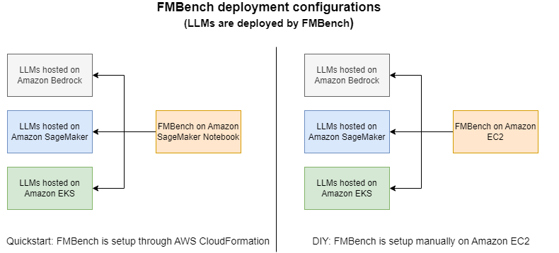
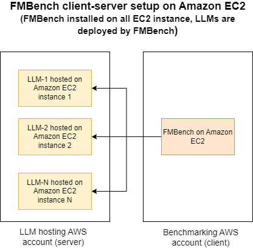

# Getting started with `FMBench`

`FMBench` is available as a Python package on [PyPi](https://pypi.org/project/fmbench) and is run as a command line tool once it is installed. All data that includes metrics, reports and results are stored in an Amazon S3 bucket.

While technically you can run `FMBench` on any AWS compute but practically speaking we either run it on a SageMaker Notebook or on EC2. Both these options are described below.

## `FMBench` in a client-server configuration on Amazon EC2

Often times there might be a need where a platform team would like to have a bunch of LLM endpoints deployed in an account available permanently for data science teams or application teams to benchmark performance and accuracy for their specific use-case. They can take advantage of a special client-server configuration for `FMBench` where it can be used to deploy models on EC2 instances in one AWS account (called the server account) and run tests against these endpoints from `FMBench` deployed on EC2 instances in another AWS account (called the client AWS account).

This has the advantage that every team that wants to benchmark a set of LLMs does not first have to deploy the LLMs, a platform team can do that for them and have these LLMs available for a longer duration as these teams do their benchmarking, for example for their specific datasets, for their specific cost and performance criteria. Using `FMBench` in this way makes the process simpler for both teams as the platform team can use `FMBench` for easily deploying the models with full control on the configuration of the serving stack without having to write any LLM deployment code for EC2 and the data science teams or application teams can test with different datasets, performance criteria and inference parameters. As long as the security groups have an inbound rule to allow access to the model endpoint (typically TCP port 8080) an `FMBench` installation in the client AWS account should be able to access an endpoint in the server AWS account.

