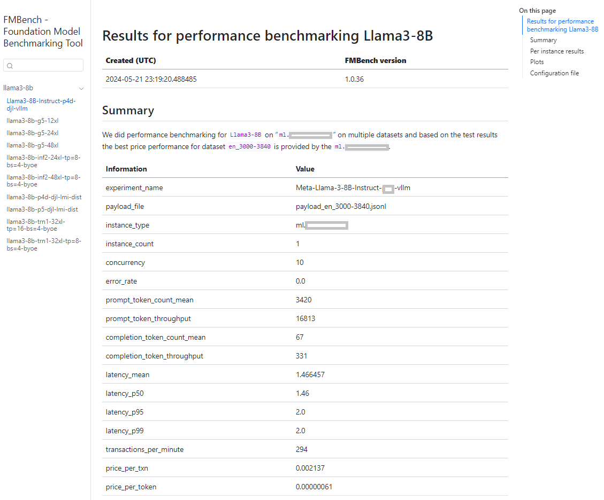

# An internal `FMBench` website

You can create an internal `FMBench` website to view results from multiple runs in a single place. All `FMBench` reports are generated as a Markdown file, these files can be rendered together in a website that is viewable in a web browser on your machine. We use [`Quarto`](https://quarto.org/) to do this. The steps below describe the process you can follow.

>[Prerequisites] **_If you have followed the [`Quickstart`](#quickstart) then these are already taken care of for you._**  
>1. You will need to clone the `FMBench` code repo from GitHub.  
>1. The `results-*` folders that contain the reports and metrics from a run are present in the root folder of the `FMBench` code repo. 

1. Run the [`render_fmbench_website.py`](./render_fmbench_website.py) Python script using the following command. This will generate a `_quarto.yml` file and render the website in the `fmbench-website` folder in the root directory of your `FMBench` repo. The website is rendered using the `Quarto` container downloaded from `registry.gitlab.com/quarto-forge/docker/quarto`.

    ```{.bash}
    source activate fmbench_python311
    curl -s https://raw.githubusercontent.com/aws-samples/foundation-model-benchmarking-tool/main/render_fmbench_website.py
    python render_fmbench_website.py
    ```

1. The website is created in the local directory `fmbench-website`. You can copy this folder into a webserver that you have OR the easiest option is to zip up this folder and download to your local machine and use the Python3  `http.server` to host the website.

    ```{.bash}
    cd fmbench-website; zip -r9 ../fmbench-website.zip *;cd -
    ```

1. Download `fmbench-website.zip` to your local machine. Extract the contents from the `fmbench-website.zip` file. Navigate to `fmbench-website` directory and run the Python3 webserver. This will start a local webserver. You should see traces being printed out on the console indicating that the webserver has started.

    ```{.bash}
    python http.server 8080
    ```

1. Open [`http://localhost:8080/`](http://localhost:8080/) in your browser and you should be able to see the `FMBench` website with all the reports that were present in the `results-*` folder in your `FMBench` installation. The following screenshot shows a picture of the `FMBench` website with links to multiple reports.


