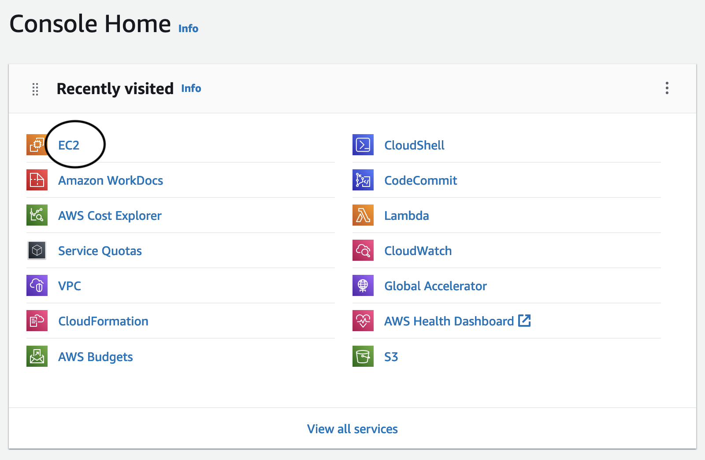
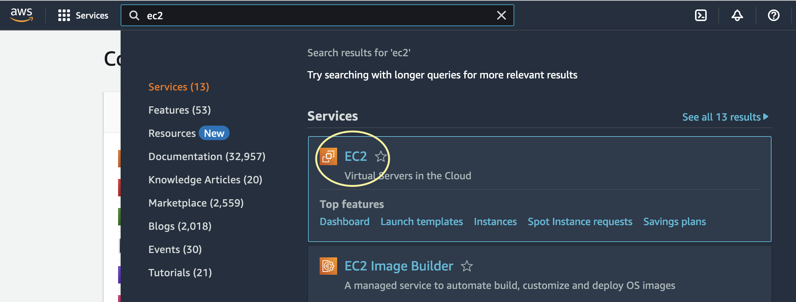
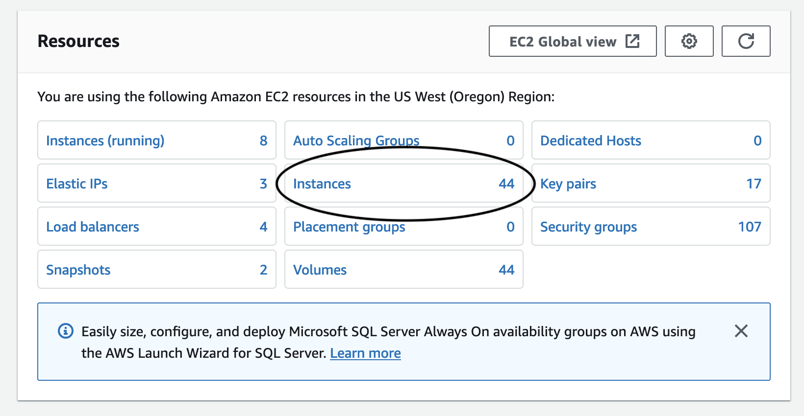
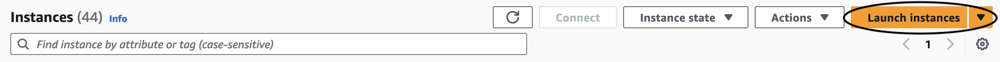
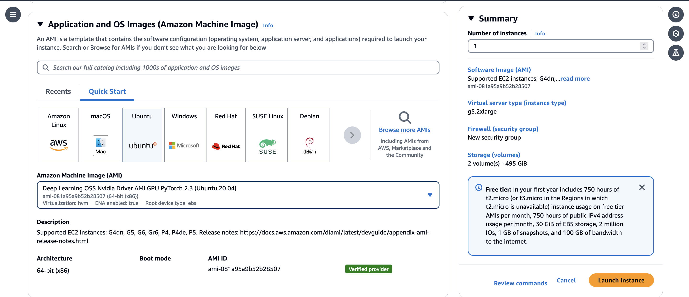
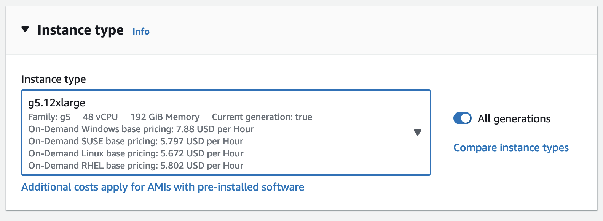
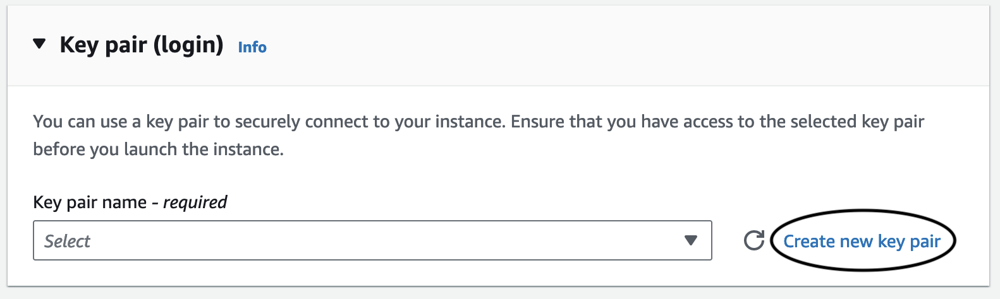
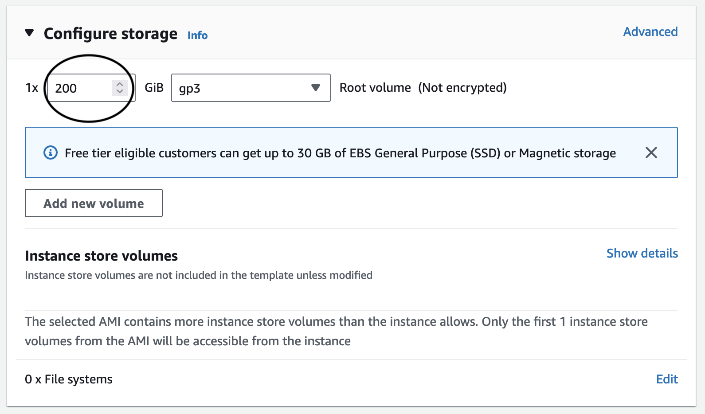
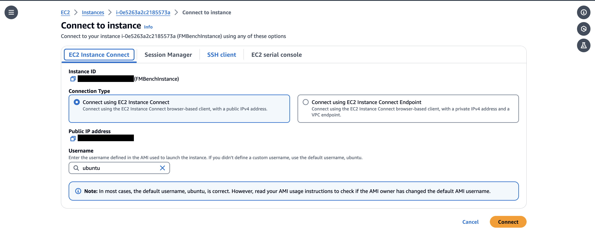

# Create an EC2 instance suitable for an LMI (Large Model Inference)

The goal of this document is for the user to be able to create an EC2 instance suitable for LMI (Large Model Inference).

### Creating EC2 Instance

1. On the homepage of AWS Console go to ‘EC2’ - it is likely in recently visited:
   

3. If not found, go to the search bar on the top of the page. Type `ec2` into the search box and click the entry that pops up with name `EC2` :
   

3. Click “Instances”:
   

5. Click "Launch Instances":
   

5. Type in a name for your instance (recommended to include your alias in the name), and then scroll down. Search for ‘deep learning ami’ in the box. Select the one that says “Deep Learning OSS Nvidia Driver AMI GPU PyTorch”. **Your version number might be different**. 
    

6. Name your instance _FMBenchInstance_.

### Instance Type

7. Scroll down to _Instance Type_. For large model inference, the g5.12xlarge is recommended.

   

### Make a key pair

8. Make a key pair by clicking _Create new key pair_. Give it a name, keep all settings as is, and then click “Create key pair”.
   
   
### Configure storage

Skip over _Network settings_ (leave it as it is), going straight to _Configure storage_. 60 GB, the suggested amount, is not nearly enough, and using that will cause the LMI docker container to download for an arbitrarily long time and then error out. Change it to 100 GB or more:
    

9. Then, we’re done with the settings of the instance. Click _Launch Instance_ to finish. You can connect to your EC2 instance using any of these option
    

### IAM Role

10. Create an IAM role to your instance called _FMBenchEC2Role_
    * Attach the following permission policies: `AmazonSageMakerFullAccess`, `AmazonBedrockFullAccess`.

    Edit the trust policy to be the following:
    ```
    {
        "Version": "2012-10-17",
        "Statement": [
            {
                "Effect": "Allow",
                "Principal": {
                    "Service": "ec2.amazonaws.com"
                },
                "Action": "sts:AssumeRole"
            },
            {
                "Effect": "Allow",
                "Principal": {
                    "Service": "sagemaker.amazonaws.com"
                },
                "Action": "sts:AssumeRole"
            },
            {
                "Effect": "Allow",
                "Principal": {
                    "Service": "bedrock.amazonaws.com"
                },
                "Action": "sts:AssumeRole"
            }
        ]
    }
    ```

# **Connect to instance**
